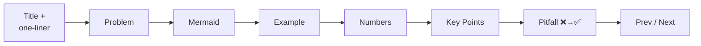

# 🐳 Docker — From Zero to Production

> Learn Docker visually: one idea per file, diagram first, runnable .NET examples, **measured** numbers. Ends with a .NET API deployed to a VPS with zero-downtime rollouts — and 25 anti-patterns to avoid.

| | |
|---|---|
| **For** | Developers who know a bit of .NET / terminal, new to Docker |
| **Style** | ≤ 2 min per file · Mermaid first · real output, not adjectives |
| **Stack** | Docker 29 · .NET 10 · Alpine · Postgres 17 · Redis 8 · Caddy 2 · Compose v2 |
| **Size** | 10 phases · 53 docs · 3 runnable examples |

## Learning Path

```mermaid
flowchart LR
    P1["1 Foundations"] --> P2["2 Images"] --> P3["3 Containers"] --> P4["4 Data & Network"] --> P5["5 Compose"]
    P5 --> P6["6 Prod Basics"] --> P7["7 Deployment"] --> P8["8 Modern Tools"] --> P9["9 .NET → VPS 🎯"] --> P10["10 Anti-patterns"]
    classDef goal fill:#fef3c7,stroke:#d97706,color:#78350f
    class P9 goal
```



## Headline Findings — measured in this repo

| Finding | Number | Doc |
|---|---|---|
| Multi-stage image | **953 MB → 123 MB**, 41 CVEs → 0 | [08](docs/02-images/08-multi-stage.md), [22](docs/06-production-basics/22-security.md) |
| Your code inside a 123 MB image | **143 kB** — the only layer a deploy changes | [07](docs/02-images/07-layers-cache.md) |
| Layer order, 3 NuGet packages | Rebuild **107–137 s → 19–45 s** | [07](docs/02-images/07-layers-cache.md) |
| No `.dockerignore` on Windows | Build **fails** (host `obj/` leaks in) | [09](docs/02-images/09-dockerignore.md) |
| Shell-form `ENTRYPOINT` | `docker stop` **10.8 s, exit 137** vs 1.1 s, exit 0 | [10](docs/03-containers/10-lifecycle.md) |
| .NET managed leak at the limit | 500 errors while container stays **"healthy"** | [13](docs/03-containers/13-limits.md) |
| Postgres without a volume | Data gone + **80 MB** orphan volumes | [14](docs/04-data-network/14-volumes.md) |
| `docker compose up -d` redeploy | **17.4 s outage** → `rollout.sh`: **0 / 67** failed | [29](docs/07-deployment/29-zero-downtime.md) |
| Default log driver, 400k lines | **44 MB** → `local` + rotation: 480 KB | [30](docs/07-deployment/30-logging.md) |
| Unhealthy + restart policy | Docker restarts it **0 times** | [28](docs/07-deployment/28-restart-health.md) |
| Scanner DB timeout | Script said "0 CVEs", reality **41** | [38](docs/08-modern-tools/38-image-scanning.md) |

## Quick Start
```bash
cd examples/02-dotnet-api
docker compose up -d --build --wait
curl -X POST localhost:8080/notes -H 'Content-Type: application/json' -d '{"text":"hello"}'
curl -i localhost:8080/notes          # X-Cache: MISS, then HIT
```

## Map

| Phase | # | Files |
|---|---|---|
| **[1 Foundations](docs/01-foundations/README.md)** | 01–04 | [What is Docker](docs/01-foundations/01-what-is-docker.md) · [VM vs Container](docs/01-foundations/02-vm-vs-container.md) · [Architecture](docs/01-foundations/03-architecture.md) · [Install](docs/01-foundations/04-install.md) |
| **[2 Images](docs/02-images/README.md)** | 05–09 | [Image vs Container](docs/02-images/05-image-vs-container.md) · [Dockerfile](docs/02-images/06-dockerfile.md) · [Layers & Cache](docs/02-images/07-layers-cache.md) · [Multi-stage](docs/02-images/08-multi-stage.md) · [.dockerignore](docs/02-images/09-dockerignore.md) |
| **[3 Containers](docs/03-containers/README.md)** | 10–13 | [Lifecycle](docs/03-containers/10-lifecycle.md) · [Commands](docs/03-containers/11-commands.md) · [ENV & Ports](docs/03-containers/12-env-ports.md) · [Limits](docs/03-containers/13-limits.md) |
| **[4 Data & Network](docs/04-data-network/README.md)** | 14–17 | [Volumes](docs/04-data-network/14-volumes.md) · [Bind Mounts](docs/04-data-network/15-bind-mounts.md) · [Networking](docs/04-data-network/16-networking.md) · [DNS](docs/04-data-network/17-dns.md) |
| **[5 Compose](docs/05-compose/README.md)** | 18–20 | [Basics](docs/05-compose/18-compose-basics.md) · [Multi-service App](docs/05-compose/19-multi-service-app.md) · [Healthchecks & depends_on](docs/05-compose/20-healthchecks-depends-on.md) |
| **[6 Prod Basics](docs/06-production-basics/README.md)** | 21–24 | [Registry & Tags](docs/06-production-basics/21-registry-tags.md) · [Security](docs/06-production-basics/22-security.md) · [Debugging](docs/06-production-basics/23-debugging.md) · [Best Practices](docs/06-production-basics/24-best-practices.md) |
| **[7 Deployment](docs/07-deployment/README.md)** | 25–33 | [Dev vs Prod](docs/07-deployment/25-dev-vs-prod.md) · [Secrets](docs/07-deployment/26-secrets.md) · [Reverse Proxy](docs/07-deployment/27-reverse-proxy.md) · [Restart & Health](docs/07-deployment/28-restart-health.md) · [Zero-downtime](docs/07-deployment/29-zero-downtime.md) · [Logging](docs/07-deployment/30-logging.md) · [Monitoring](docs/07-deployment/31-monitoring.md) · [Backups](docs/07-deployment/32-backups.md) · [Scaling](docs/07-deployment/33-scaling-path.md) |
| **[8 Modern Tools](docs/08-modern-tools/README.md)** | 34–41 | [buildx](docs/08-modern-tools/34-buildx.md) · [GHCR + Actions](docs/08-modern-tools/35-ghcr-actions.md) · [Proxies](docs/08-modern-tools/36-proxies.md) · [Coolify/Dokploy/Kamal](docs/08-modern-tools/37-self-hosted-paas.md) · [Trivy/Scout](docs/08-modern-tools/38-image-scanning.md) · [Portainer](docs/08-modern-tools/39-portainer.md) · [Dev & Test](docs/08-modern-tools/40-dev-test.md) · [Podman](docs/08-modern-tools/41-podman.md) |
| **[9 .NET → VPS](docs/09-dotnet-vps/README.md)** 🎯 | 42–48 | [VPS Setup](docs/09-dotnet-vps/42-vps-setup.md) · [Dockerfile](docs/09-dotnet-vps/43-dotnet-dockerfile.md) · [compose.prod.yml](docs/09-dotnet-vps/44-compose-prod.md) · [EF Migrations](docs/09-dotnet-vps/45-ef-migrations.md) · [CI/CD](docs/09-dotnet-vps/46-cicd.md) · [Rollback](docs/09-dotnet-vps/47-rollback.md) · [Checklist](docs/09-dotnet-vps/48-checklist.md) |
| **[10 Anti-patterns](docs/10-anti-patterns/README.md)** | 49–53 | [Dockerfile #1–5](docs/10-anti-patterns/49-dockerfile.md) · [Runtime #6–10](docs/10-anti-patterns/50-runtime.md) · [Data #11–15](docs/10-anti-patterns/51-data.md) · [Network & Security #16–20](docs/10-anti-patterns/52-network-security.md) · [Deploy & CI #21–25](docs/10-anti-patterns/53-deploy-ci.md) |

## Examples

| Folder | What | Used in |
|---|---|---|
| [01-hello-dotnet](examples/01-hello-dotnet) | Minimal API: `/`, `/limits`, `/allocate`, `/health` + naive / multi-stage / multi-arch Dockerfiles | 05–17, 34 |
| [02-dotnet-api](examples/02-dotnet-api) | Notes API: EF Core + Postgres + Redis, dev & prod Compose, Caddy, secrets, rollout/rollback/backup scripts, CI workflow, Testcontainers | 18–53 |
| [03-monitoring](examples/03-monitoring) | Prometheus + Grafana + cAdvisor + node-exporter + Uptime Kuma | 31 |

## How Each File Is Written



| Label | Meaning |
|---|---|
| **measured** | Run on Docker Desktop 29 (Windows, 4 CPUs, 7.7 GiB) — your numbers differ, ratios hold |
| **typical** | Common range, not measured here |
| **validated** | Config checked (`compose config`, `promtool`, `actionlint`) but not run long-term |
