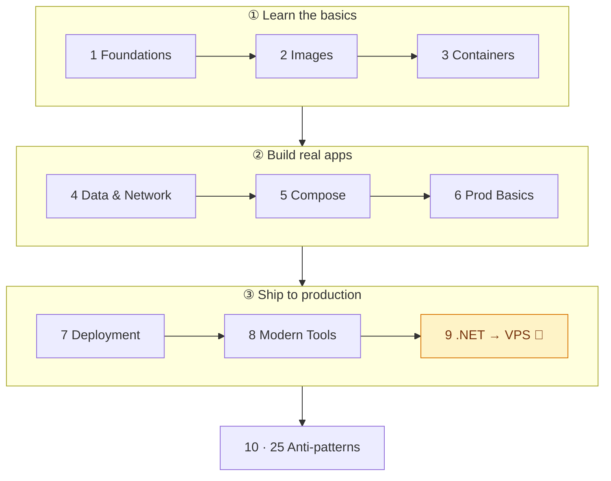
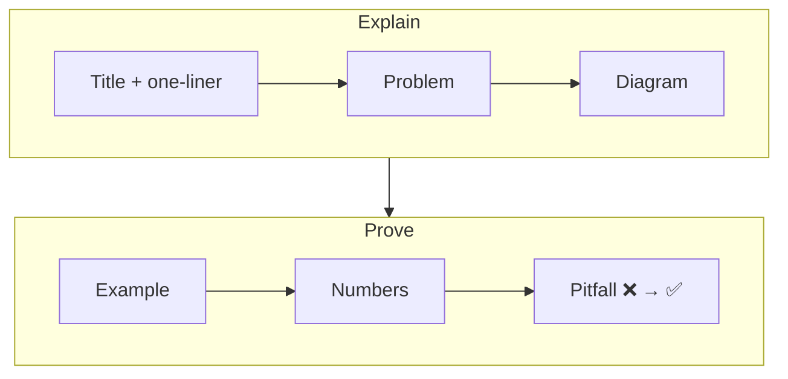

# 🐳 Docker — From Zero to Production

> Learn Docker visually: one idea per file, diagram first, runnable .NET examples, **measured** numbers.
> Ends with a .NET API on a VPS with zero-downtime deploys — plus 25 anti-patterns to avoid.

**Docker 29 · .NET 10 · Alpine · Postgres 17 · Redis 8 · Caddy 2 · Compose v2** — 10 phases · 53 docs · 3 runnable examples

---

## 🗺️ Learning Path



| Phase | You'll be able to… | Docs |
|---|---|---|
| [1 Foundations](docs/01-foundations/README.md) | Explain containers vs VMs, install Docker | 01–04 |
| [2 Images](docs/02-images/README.md) | Write a small, cached, multi-stage Dockerfile | 05–09 |
| [3 Containers](docs/03-containers/README.md) | Run, inspect, configure, and limit containers | 10–13 |
| [4 Data & Network](docs/04-data-network/README.md) | Keep data safe, connect containers by name | 14–17 |
| [5 Compose](docs/05-compose/README.md) | Run API + Postgres + Redis with one command | 18–20 |
| [6 Prod Basics](docs/06-production-basics/README.md) | Tag, secure, and debug images | 21–24 |
| [7 Deployment](docs/07-deployment/README.md) | HTTPS, secrets, zero-downtime, logs, backups | 25–33 |
| [8 Modern Tools](docs/08-modern-tools/README.md) | Pick the right tool: buildx, CI, Trivy, Kamal… | 34–41 |
| [9 .NET → VPS](docs/09-dotnet-vps/README.md) 🎯 | Ship a .NET API to a VPS with CI/CD + rollback | 42–48 |
| [10 Anti-patterns](docs/10-anti-patterns/README.md) | Spot 25 common mistakes in any project | 49–53 |

---

## 🔬 Headline Findings — measured in this repo

| Finding | Result | Doc |
|---|---|---|
| Multi-stage build | **953 MB → 123 MB**, 41 CVEs → 0 | [08](docs/02-images/08-multi-stage.md) |
| Your code in a 123 MB image | **143 kB** — the only layer a deploy changes | [07](docs/02-images/07-layers-cache.md) |
| Layer order (3 NuGet packages) | Rebuild **107–137 s → 19–45 s** | [07](docs/02-images/07-layers-cache.md) |
| No `.dockerignore` on Windows | Build **fails** | [09](docs/02-images/09-dockerignore.md) |
| Shell-form `ENTRYPOINT` | Stop **10.8 s, exit 137** vs 1.1 s, exit 0 | [10](docs/03-containers/10-lifecycle.md) |
| .NET memory leak at the limit | 500 errors, container still **"healthy"** | [13](docs/03-containers/13-limits.md) |
| Postgres without a volume | Data gone + **80 MB** orphan volumes | [14](docs/04-data-network/14-volumes.md) |
| `compose up -d` redeploy | **17.4 s outage** → `rollout.sh`: **0** failed | [29](docs/07-deployment/29-zero-downtime.md) |
| Default logging, 400k lines | **44 MB** → rotated `local`: 480 KB | [30](docs/07-deployment/30-logging.md) |
| Unhealthy + restart policy | Restarted **0 times** | [28](docs/07-deployment/28-restart-health.md) |

---

## 🚀 Quick Start

```bash
git clone https://github.com/wesamkhateeb98-creator/docker-zero-to-production.git
cd docker-zero-to-production/examples/02-dotnet-api
docker compose up -d --build --wait

curl -X POST localhost:8080/notes -H 'Content-Type: application/json' -d '{"text":"hello"}'
curl -i localhost:8080/notes        # X-Cache: MISS → run again → HIT
docker compose down                 # add -v to also delete the data
```

---

## 📚 All 53 Docs

<details>
<summary><b>1 · Foundations</b> — 01–04</summary>

| # | Doc | One line |
|---|---|---|
| 01 | [What is Docker](docs/01-foundations/01-what-is-docker.md) | App + deps in one image; when to skip it |
| 02 | [VM vs Container](docs/01-foundations/02-vm-vs-container.md) | Shared kernel; microVMs in between |
| 03 | [Architecture](docs/01-foundations/03-architecture.md) | CLI → dockerd → containerd → runc |
| 04 | [Install](docs/01-foundations/04-install.md) | Desktop vs Engine; Windows gotchas |

</details>

<details>
<summary><b>2 · Images</b> — 05–09</summary>

| # | Doc | One line |
|---|---|---|
| 05 | [Image vs Container](docs/02-images/05-image-vs-container.md) | Class vs object; shared layers |
| 06 | [Dockerfile](docs/02-images/06-dockerfile.md) | First Dockerfile and its 4 problems |
| 07 | [Layers & Cache](docs/02-images/07-layers-cache.md) | Stable first, volatile last |
| 08 | [Multi-stage](docs/02-images/08-multi-stage.md) | Build with SDK, ship runtime |
| 09 | [.dockerignore](docs/02-images/09-dockerignore.md) | Small context, working builds |

</details>

<details>
<summary><b>3 · Containers</b> — 10–13</summary>

| # | Doc | One line |
|---|---|---|
| 10 | [Lifecycle](docs/03-containers/10-lifecycle.md) | States, exit codes, restart policies |
| 11 | [Commands](docs/03-containers/11-commands.md) | Daily cheatsheet + which shell exists |
| 12 | [ENV & Ports](docs/03-containers/12-env-ports.md) | Config precedence, port binding |
| 13 | [Resource Limits](docs/03-containers/13-limits.md) | Managed vs native OOM |

</details>

<details>
<summary><b>4 · Data & Network</b> — 14–17</summary>

| # | Doc | One line |
|---|---|---|
| 14 | [Volumes](docs/04-data-network/14-volumes.md) | Data that survives `docker rm` |
| 15 | [Bind Mounts](docs/04-data-network/15-bind-mounts.md) | Host folders; Windows speed cost |
| 16 | [Networking](docs/04-data-network/16-networking.md) | Drivers and isolation |
| 17 | [Container DNS](docs/04-data-network/17-dns.md) | `db:5432`, not IPs or `localhost` |

</details>

<details>
<summary><b>5 · Compose</b> — 18–20</summary>

| # | Doc | One line |
|---|---|---|
| 18 | [Compose Basics](docs/05-compose/18-compose-basics.md) | One file, ten commands |
| 19 | [Multi-service App](docs/05-compose/19-multi-service-app.md) | API + Postgres + Redis + migrator |
| 20 | [Healthchecks & depends_on](docs/05-compose/20-healthchecks-depends-on.md) | Start in the right order |

</details>

<details>
<summary><b>6 · Production Basics</b> — 21–24</summary>

| # | Doc | One line |
|---|---|---|
| 21 | [Registry & Tags](docs/06-production-basics/21-registry-tags.md) | Tag by commit, pin by digest |
| 22 | [Security](docs/06-production-basics/22-security.md) | Non-root, read-only, scanned |
| 23 | [Debugging](docs/06-production-basics/23-debugging.md) | Symptom → cause in 5 commands |
| 24 | [Best Practices](docs/06-production-basics/24-best-practices.md) | One-page checklist |

</details>

<details>
<summary><b>7 · Deployment</b> — 25–33</summary>

| # | Doc | One line |
|---|---|---|
| 25 | [Dev vs Prod](docs/07-deployment/25-dev-vs-prod.md) | Two Compose files, two jobs |
| 26 | [Secrets](docs/07-deployment/26-secrets.md) | Files in `/run/secrets` |
| 27 | [Reverse Proxy](docs/07-deployment/27-reverse-proxy.md) | Caddy: HTTPS in 5 lines |
| 28 | [Restart & Health](docs/07-deployment/28-restart-health.md) | "Unhealthy" isn't restarted |
| 29 | [Zero-downtime](docs/07-deployment/29-zero-downtime.md) | 17.4 s → 0 s |
| 30 | [Logging](docs/07-deployment/30-logging.md) | Rotate or fill the disk |
| 31 | [Monitoring](docs/07-deployment/31-monitoring.md) | Prometheus + Grafana + Kuma |
| 32 | [Backups](docs/07-deployment/32-backups.md) | Dump, ship off-site, test restore |
| 33 | [Scaling Path](docs/07-deployment/33-scaling-path.md) | Compose → Swarm → Kubernetes |

</details>

<details>
<summary><b>8 · Modern Tools</b> — 34–41</summary>

| # | Doc | One line |
|---|---|---|
| 34 | [buildx](docs/08-modern-tools/34-buildx.md) | One tag for amd64 + arm64 |
| 35 | [GHCR + Actions](docs/08-modern-tools/35-ghcr-actions.md) | Build, scan, push, deploy |
| 36 | [Traefik vs Caddy vs Nginx](docs/08-modern-tools/36-proxies.md) | Same routing, three configs |
| 37 | [Coolify / Dokploy / Kamal](docs/08-modern-tools/37-self-hosted-paas.md) | Heroku on your VPS |
| 38 | [Trivy / Scout](docs/08-modern-tools/38-image-scanning.md) | CVE scans that fail the build |
| 39 | [Portainer](docs/08-modern-tools/39-portainer.md) | Web UI for containers |
| 40 | [Dev Containers & Testcontainers](docs/08-modern-tools/40-dev-test.md) | Same toolchain; real DB in tests |
| 41 | [Podman](docs/08-modern-tools/41-podman.md) | Daemonless, rootless alternative |

</details>

<details>
<summary><b>9 · .NET → VPS</b> 🎯 — 42–48</summary>

| # | Doc | One line |
|---|---|---|
| 42 | [VPS Setup](docs/09-dotnet-vps/42-vps-setup.md) | SSH, firewall, Docker, daemon.json |
| 43 | [.NET Dockerfile](docs/09-dotnet-vps/43-dotnet-dockerfile.md) | `runtime` + `migrator` targets |
| 44 | [compose.prod.yml](docs/09-dotnet-vps/44-compose-prod.md) | Every production line explained |
| 45 | [EF Migrations](docs/09-dotnet-vps/45-ef-migrations.md) | Bundle as a one-shot job |
| 46 | [CI/CD](docs/09-dotnet-vps/46-cicd.md) | Push → GHCR → rollout |
| 47 | [Rollback](docs/09-dotnet-vps/47-rollback.md) | Previous SHA, zero downtime |
| 48 | [Checklist](docs/09-dotnet-vps/48-checklist.md) | 20 checks before go-live |

</details>

<details>
<summary><b>10 · Anti-patterns</b> — 49–53</summary>

| # | Doc | Covers |
|---|---|---|
| 49 | [Dockerfile](docs/10-anti-patterns/49-dockerfile.md) | #1–5 |
| 50 | [Runtime](docs/10-anti-patterns/50-runtime.md) | #6–10 |
| 51 | [Data](docs/10-anti-patterns/51-data.md) | #11–15 |
| 52 | [Network & Security](docs/10-anti-patterns/52-network-security.md) | #16–20 |
| 53 | [Deploy & CI](docs/10-anti-patterns/53-deploy-ci.md) | #21–25 |

</details>

---

## 🧪 Examples

| Folder | What's inside | Used in |
|---|---|---|
| [01-hello-dotnet](examples/01-hello-dotnet) | Minimal API + naive / multi-stage / multi-arch Dockerfiles | 05–17, 34 |
| [02-dotnet-api](examples/02-dotnet-api) | Notes API (EF Core, Postgres, Redis), dev + prod Compose, Caddy, deploy scripts, CI, tests | 18–53 |
| [03-monitoring](examples/03-monitoring) | Prometheus, Grafana, cAdvisor, node-exporter, Uptime Kuma | 31 |

---

## ✍️ How Each Doc Is Written



| Label | Meaning |
|---|---|
| **measured** | Run on Docker Desktop 29 (Windows, 4 CPUs, 7.7 GiB) — your numbers differ, ratios hold |
| **typical** | Common range, not measured here |
| **validated** | Config checked (`compose config`, `promtool`, `actionlint`), not run long-term |
