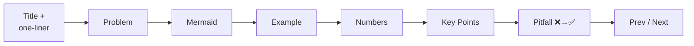

# 🐳 Docker — From Zero to Production

> Learn Docker visually: one idea per file, diagram first, runnable .NET example, **measured** numbers. The path ends with deploying a .NET API to a VPS.

| | |
|---|---|
| **For** | Developers who know a bit of .NET / terminal, new to Docker |
| **Style** | ≤ 2 min per file · Mermaid first · real output, not adjectives |
| **Stack** | Docker 29 · .NET 10 · Alpine · Compose v2 |
| **Progress** | Phases 1–3 ✅ (13 / 48 files) |

## Learning Path


## What You'll Learn — measured in this repo

| Finding | Number | Where |
|---|---|---|
| Multi-stage shrinks the image | **953 MB → 123 MB** (7.7×) | [08](docs/02-images/08-multi-stage.md) |
| Your code in a 123 MB image | **143 kB** — the only layer a deploy changes | [07](docs/02-images/07-layers-cache.md) |
| Right layer order, 3 NuGet packages | Rebuild **107–137 s → 19–45 s** | [07](docs/02-images/07-layers-cache.md) |
| No `.dockerignore` on Windows | Build **fails** (host `obj/` leaks in) | [09](docs/02-images/09-dockerignore.md) |
| Shell-form `ENTRYPOINT` (Debian) | `docker stop` **10.8 s, exit 137** vs 1.1 s, exit 0 | [10](docs/03-containers/10-lifecycle.md) |
| .NET managed leak at the memory limit | 500 errors, container **stays "healthy"** | [13](docs/03-containers/13-limits.md) |
| `--memory 256m` without `--memory-swap` | Leak reached 280 MB (swap) | [13](docs/03-containers/13-limits.md) |

## Quick Start
```bash
cd examples/01-hello-dotnet
docker build -t hello-dotnet:good .
docker run --rm -p 8080:8080 -e Greeting="Hi" hello-dotnet:good
curl localhost:8080
# {"message":"Hi","machine":"7aad08dba26a","environment":"Production"}
```

## Map

### ✅ [Phase 1 — Foundations](docs/01-foundations/README.md)
| # | Idea | One line |
|---|---|---|
| 01 | [What is Docker](docs/01-foundations/01-what-is-docker.md) | App + deps in one unit; when to skip it |
| 02 | [VM vs Container](docs/01-foundations/02-vm-vs-container.md) | Shared kernel; microVMs in between |
| 03 | [Architecture](docs/01-foundations/03-architecture.md) | CLI → dockerd → containerd → runc |
| 04 | [Install](docs/01-foundations/04-install.md) | Desktop vs Engine; Windows gotchas |

### ✅ [Phase 2 — Images](docs/02-images/README.md)
| # | Idea | One line |
|---|---|---|
| 05 | [Image vs Container](docs/02-images/05-image-vs-container.md) | Class vs object; shared layers |
| 06 | [Dockerfile](docs/02-images/06-dockerfile.md) | First Dockerfile + its 4 problems |
| 07 | [Layers & Cache](docs/02-images/07-layers-cache.md) | Stable first, volatile last |
| 08 | [Multi-stage](docs/02-images/08-multi-stage.md) | Build with SDK, ship runtime |
| 09 | [.dockerignore](docs/02-images/09-dockerignore.md) | Small context, working builds |

### ✅ [Phase 3 — Containers](docs/03-containers/README.md)
| # | Idea | One line |
|---|---|---|
| 10 | [Lifecycle](docs/03-containers/10-lifecycle.md) | States, exit codes, restart policies |
| 11 | [Commands](docs/03-containers/11-commands.md) | Daily cheatsheet + which shell exists |
| 12 | [ENV & Ports](docs/03-containers/12-env-ports.md) | Config precedence, port binding |
| 13 | [Resource Limits](docs/03-containers/13-limits.md) | Managed vs native OOM |

<details>
<summary><b>⏳ Phases 4–9 — coming next (35 files)</b></summary>

| Phase | # | Idea |
|---|---|---|
| **4 Data & Network** | 14–17 | Volumes · Bind mounts · Networking · Container DNS |
| **5 Compose** | 18–20 | Compose basics · API + Postgres + Redis · Healthchecks & `depends_on` |
| **6 Prod Basics** | 21–24 | Registry & tags · Security · Debugging · Best practices |
| **7 Deployment** | 25–33 | Dev vs prod · Secrets · Reverse proxy + HTTPS · Restart & health · Zero-downtime · Logging · Monitoring · Backups · Scaling path |
| **8 Modern Tools** | 34–41 | buildx · GHCR + Actions · Traefik / Caddy / Nginx · Coolify / Dokploy / Kamal · Trivy / Scout · Portainer · Dev Containers & Testcontainers · Podman |
| **9 .NET → VPS** | 42–48 | VPS setup · Prod Dockerfile · `compose.prod.yml` · EF migrations · CI/CD · Rollback · Checklist |

</details>

## Repo Layout
```
Docker/
├── README.md                  ← you are here
├── docs/
│   ├── 01-foundations/        # README + 01–04
│   ├── 02-images/             # README + 05–09
│   └── 03-containers/         # README + 10–13
└── examples/
    └── 01-hello-dotnet/       # .NET 10 API: / · /limits · /allocate · /health
```

## How Each File Is Written



| Label in docs | Meaning |
|---|---|
| **measured** | Run on Docker Desktop 29, 4 CPUs, 7.7 GiB — your numbers will differ, ratios hold |
| **typical** | Common industry range, not measured here |
