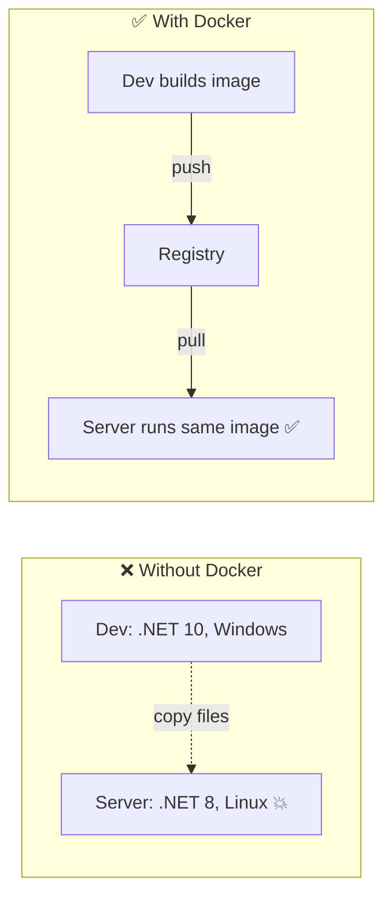

# What is Docker

> Docker packages an app **and everything it needs** into one image that runs the same everywhere.

## Problem
"Works on my machine": different OS, runtime version, or missing library on the server.



## Example
```bash
# Nothing installed on the host except Docker — all three still work:
docker run -d -p 5432:5432 -e POSTGRES_PASSWORD=dev postgres:17-alpine
docker run -d -p 6379:6379 redis:8-alpine
docker run --rm mcr.microsoft.com/dotnet/sdk:10.0 dotnet --version
```

## Numbers — new developer onboarding (typical)
| | Without Docker | With Docker |
|---|---|---|
| Install .NET + Postgres + Redis | 1–2 h, version drift | `docker compose up` ≈ 2 min |
| "Which Postgres version?" | Whatever was installed | Pinned in one file |

## Core Vocabulary
| Term | One line |
|---|---|
| Image | Read-only template (app + deps) |
| Container | Running instance of an image |
| Dockerfile | Recipe that builds an image |
| Registry | Image storage (Docker Hub, GHCR) |
| Volume | Data that outlives a container |
| OCI | Open standard → images also run on Podman, Kubernetes |

## Use It / Skip It
| ✅ Good fit | ❌ Poor fit |
|---|---|
| Web APIs, workers, databases in dev | Desktop GUI apps |
| Same stack on many machines | Hard real-time / kernel-specific work |
| CI builds, reproducible tooling | Single static site (a CDN is simpler) |

## Key Points
- Build once, run anywhere
- Same image: dev → CI → prod
- Dependencies travel with the app

## Pitfall
❌ "Docker = lightweight VM" → ✅ Docker = isolated **process** on the host kernel ([02](02-vm-vs-container.md))

---
[Next → 02 VM vs Container](02-vm-vs-container.md)
