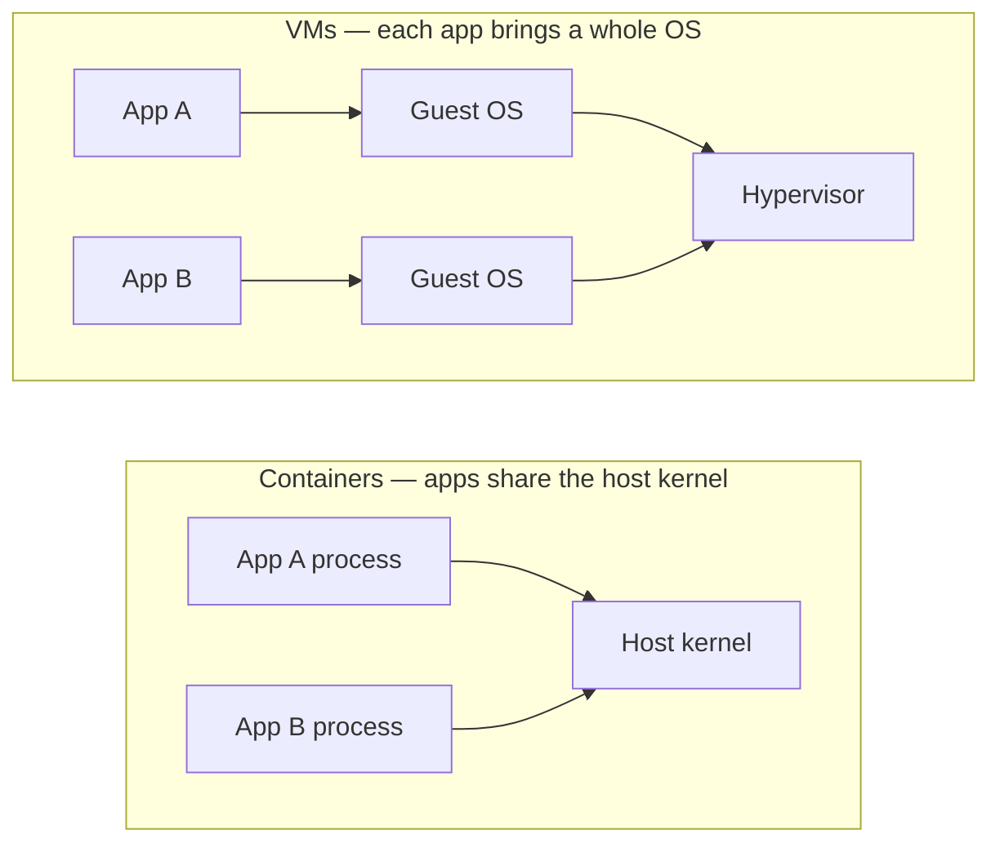

# VM vs Container

> A VM virtualizes **hardware**; a container isolates a **process** and shares the host kernel.

## Problem
A full VM per app wastes GBs of RAM/disk and takes a minute to boot.



## Example
```bash
# Container = process. Visible from the host (Linux host only):
docker run -d --name web nginx:alpine
ps aux | grep "nginx: master"    # a normal host process, just namespaced
docker top web                   # same process, seen from Docker
```

## Numbers
| | VM (typical) | Container (measured, this repo) |
|---|---|---|
| Start | 30–60 s | `alpine true`: 1.5 s · .NET API → first HTTP 200: 2.8 s |
| Idle RAM | 500 MB – 1 GB (guest OS) | .NET API: 20 MiB |
| Disk per instance | 2–10 GB | 8 KB writable layer + shared image ([05](../02-images/05-image-vs-container.md)) |
| Isolation | Own kernel | Shared kernel |

## The Middle Ground
| Option | Isolation | Start | Example |
|---|---|---|---|
| Container | Namespaces | ~1 s | Docker, Podman |
| Sandboxed container | User-space kernel | ~1 s | gVisor |
| MicroVM | Own tiny kernel | ~0.2 s | Firecracker, Kata |
| VM | Full guest OS | 30–60 s | Hyper-V, KVM |

## Key Points
- Containers share the host kernel
- Linux containers need a Linux kernel
- Windows/macOS run a hidden Linux VM
- CPU arch must match (amd64 ≠ arm64)

## Pitfall
❌ Treat a container as a security boundary like a VM → ✅ Shared kernel: a kernel bug affects all containers; never run untrusted code as root

❌ Build on Apple Silicon, run on an amd64 VPS → ✅ `exec format error`; build with `--platform linux/amd64`

---
← [01 What is Docker](01-what-is-docker.md) · [Next → 03 Docker Architecture](03-architecture.md)
