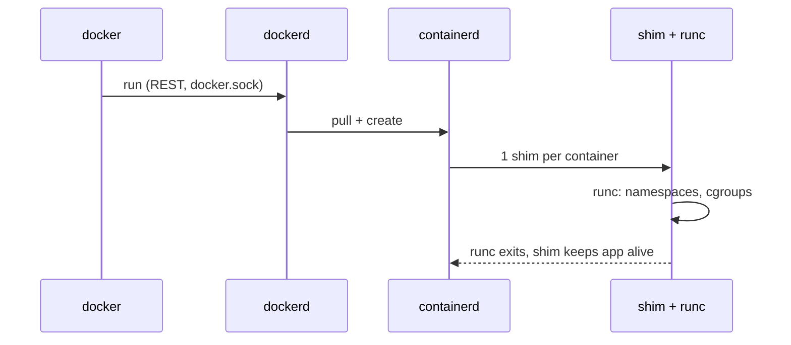

# Docker Architecture

> `docker` is only a client; the daemon does the work, and Linux kernel features provide isolation.

## Problem
Without the mental model, errors like `Cannot connect to the Docker daemon` make no sense.



## Kernel Building Blocks
| Feature | Isolates / Controls | Proof in this repo |
|---|---|---|
| `pid` namespace | Process tree | `docker run --rm alpine ps` → PID 1 = `ps` |
| `net` namespace | Network stack | Own IP, own port 8080 |
| `mnt` namespace | Filesystem view | Own `/` |
| `uts` namespace | Hostname | `hostname` = container ID (`d67ac06efb53`) |
| cgroups | CPU, RAM, PIDs | `--memory 256m` ([13](../03-containers/13-limits.md)) |
| OverlayFS | Layered filesystem | Image layers + writable layer |

## Example
```bash
docker version                  # Client AND Server = two programs
docker context ls               # which daemon the CLI talks to
# Linux only — the raw REST API behind every CLI command:
curl --unix-socket /var/run/docker.sock http://localhost/version
```

## "Cannot connect to the Docker daemon"
| Cause | Fix |
|---|---|
| Daemon not running | Start Docker Desktop / `sudo systemctl start docker` |
| No permission on socket | `sudo usermod -aG docker $USER`, re-login |
| Wrong context | `docker context use default` |

## Key Points
- CLI → REST API → daemon
- containerd manages container lifecycle
- runc creates the actual process
- Isolation = namespaces, limits = cgroups

## Pitfall
❌ Mount `/var/run/docker.sock` into untrusted containers → ✅ The socket = **root access** to the host

---
← [02 VM vs Container](02-vm-vs-container.md) · [Next → 04 Install & Hello World](04-install.md)
