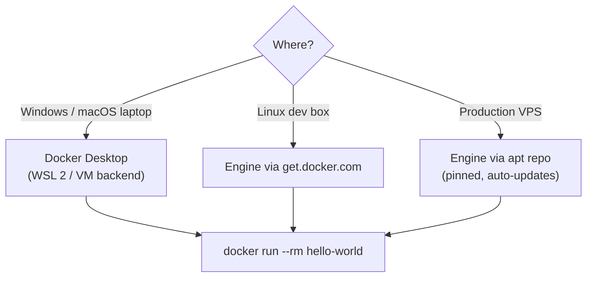

# Install & Hello World

> Docker Desktop on Windows/macOS, Docker Engine on Linux servers.

## Problem
Which edition to install, and how to verify it actually works.



## Example — Production (Ubuntu, official apt repo)
```bash
sudo install -m 0755 -d /etc/apt/keyrings
sudo curl -fsSL https://download.docker.com/linux/ubuntu/gpg -o /etc/apt/keyrings/docker.asc
echo "deb [arch=$(dpkg --print-architecture) signed-by=/etc/apt/keyrings/docker.asc] \
https://download.docker.com/linux/ubuntu $(. /etc/os-release && echo "$VERSION_CODENAME") stable" \
  | sudo tee /etc/apt/sources.list.d/docker.list
sudo apt-get update
sudo apt-get install -y docker-ce docker-ce-cli containerd.io docker-buildx-plugin docker-compose-plugin
sudo usermod -aG docker $USER && newgrp docker
```

## Example — Windows
```powershell
winget install Docker.DockerDesktop       # enable WSL 2 when prompted
docker run --rm hello-world
```

## Verify
```bash
docker version            # Client + Server both listed
docker compose version    # Compose v2 plugin
docker info --format '{{.OperatingSystem}} | {{.NCPU}} CPUs | {{.MemTotal}}'
# Docker Desktop | 4 CPUs | 8265515008
```

## Desktop Options
| Tool | OS | Cost |
|---|---|---|
| Docker Desktop | Win / Mac / Linux | Free for personal & small business; paid for larger companies |
| Rancher Desktop / Podman Desktop | Win / Mac / Linux | Free |
| OrbStack | Mac | Free personal |

## Windows Gotchas
| Symptom | Fix |
|---|---|
| WSL 2 VM eats RAM | `%UserProfile%\.wslconfig` → `[wsl2]` `memory=6GB` |
| Git Bash: `/tmp/x` becomes `C:/Users/.../Temp/x` | `MSYS_NO_PATHCONV=1 docker exec api ls /tmp/x` |
| `/bin/sh^M: bad interpreter` | `.gitattributes`: `* text=auto eol=lf` |

## Key Points
- Client + Server must both appear
- Compose v2: `docker compose` (space)
- `docker` group = root-equivalent

## Pitfall
❌ `curl get.docker.com | sh` on production → ✅ apt repo: reviewable, pinned, updated with the OS

❌ `docker-compose` (v1, retired) → ✅ `docker compose`

---
← [03 Architecture](03-architecture.md) · [Next phase → 02 Images](../02-images/README.md)
