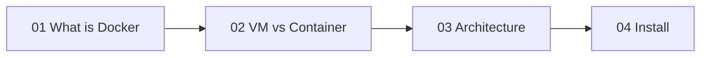

# Phase 1 — Foundations

> What Docker is, why it exists, and how it runs on your machine.

| # | Idea | One line | File |
|---|---|---|---|
| 01 | What is Docker | Package app + deps into one unit | [01](01-what-is-docker.md) |
| 02 | VM vs Container | Share the kernel, skip the guest OS | [02](02-vm-vs-container.md) |
| 03 | Architecture | CLI → dockerd → containerd → runc | [03](03-architecture.md) |
| 04 | Install | Docker Desktop / Engine + hello-world | [04](04-install.md) |

**Prerequisites:** basic terminal usage.

---
[Next phase → 02 Images](../02-images/README.md)
