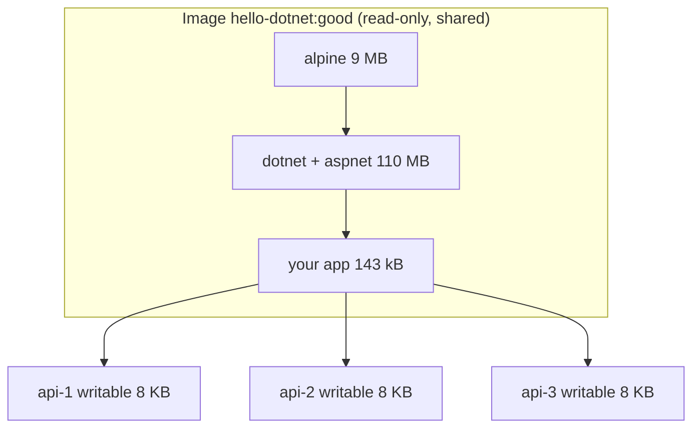

# Image vs Container

> Image = read-only template (class). Container = image + thin writable layer (object).

## Problem
"I edited a file inside the container — why is it gone after redeploy?" Because a redeploy = a **new** container.



## Example
```bash
# 1 image → 3 containers
for i in 1 2 3; do docker run -d --name api-$i hello-dotnet:good; done

docker ps -s --format 'table {{.Names}}\t{{.Size}}'
# NAMES   SIZE
# api-3   8.19kB (virtual 123MB)   ← only 8 KB each; the 123 MB is SHARED
# api-2   8.19kB (virtual 123MB)
# api-1   8.19kB (virtual 123MB)

docker exec api-1 sh -c 'echo hi > /tmp/x'   # lands in api-1's writable layer only
docker exec api-2 ls /tmp/x
# ls: /tmp/x: No such file or directory
```

## Comparison
| | Image | Container |
|---|---|---|
| Analogy | Class | Object |
| Mutable | ❌ | ✅ (writable layer) |
| Created by | `docker build` / `pull` | `docker run` / `create` |
| Stored | Registry + local cache | Local only |
| List | `docker image ls` | `docker ps -a` |
| Identity | `name:tag` (moves) / `@sha256:` digest (fixed) | Name / ID |
| Cost of one more | Build: seconds–minutes | Start: ~1 s, 8 KB disk |

## Key Points
- One image, many containers
- Layers shared → cheap to scale
- Container changes are disposable
- Tags move, digests never do

## Pitfall
❌ `docker exec` to patch prod code → ✅ Change code, rebuild, redeploy (the patch dies with the container)

---
← [Phase 1](../01-foundations/README.md) · [Next → 06 Dockerfile](06-dockerfile.md)
