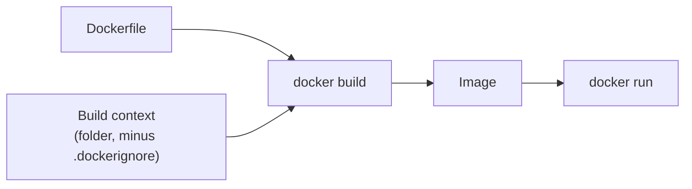

# Dockerfile

> A Dockerfile is a top-to-bottom recipe; each instruction adds a layer or a metadata setting.

## Problem
You need a repeatable, versioned way to turn source code into an image — no SDK on the server.



## Example — your first Dockerfile ([Dockerfile.naive](../../examples/01-hello-dotnet/Dockerfile.naive))
```dockerfile
FROM mcr.microsoft.com/dotnet/sdk:10.0
WORKDIR /src
COPY . .
RUN dotnet publish -c Release -o /app
WORKDIR /app
ENTRYPOINT dotnet HelloApi.dll
```
```bash
docker build -t hello-dotnet:naive -f Dockerfile.naive .
docker run --rm -p 8080:8080 hello-dotnet:naive
```

It works — but every line has a cost, fixed in the next files:

| Line | Problem | Fixed in |
|---|---|---|
| `FROM …/sdk:10.0` | Ships the SDK: 953 MB | [08](08-multi-stage.md) → 123 MB |
| `COPY . .` before build | Any edit re-restores packages | [07](07-layers-cache.md) |
| *(no `USER`)* | Runs as root | [08](08-multi-stage.md) |
| `ENTRYPOINT dotnet …` | Shell form: `docker stop` hangs, exit 137 | [10](../03-containers/10-lifecycle.md) |

## Instructions
| Instruction | Does | Adds layer? |
|---|---|---|
| `FROM` | Base image | ✅ |
| `WORKDIR` | `mkdir -p` + `cd` | ✅ |
| `COPY` | Context → image | ✅ |
| `RUN` | Execute at build time | ✅ |
| `ENV` / `ARG` | Variable: build+run / build only | meta |
| `EXPOSE` | Documents a port | meta |
| `USER` | Run as this user | meta |
| `HEALTHCHECK` | Health probe | meta |
| `ENTRYPOINT` / `CMD` | Start command / default args | meta |

## ENTRYPOINT vs CMD — `docker run img X`
| Dockerfile has | Runs |
|---|---|
| `ENTRYPOINT ["dotnet","App.dll"]` | `dotnet App.dll X` (appends) |
| `CMD ["dotnet","App.dll"]` | `X` (replaces) |

## Key Points
- Exec form `["…"]` always
- `COPY` over `ADD`
- No secrets in `ARG` / `ENV`
- Base images set env too (`ASPNETCORE_HTTP_PORTS=8080`)

## Pitfall
❌ `COPY . .  # copy source` → ✅ `#` is a comment **only at line start**; mid-line it becomes an argument

---
← [05 Image vs Container](05-image-vs-container.md) · [Next → 07 Layers & Build Cache](07-layers-cache.md)
