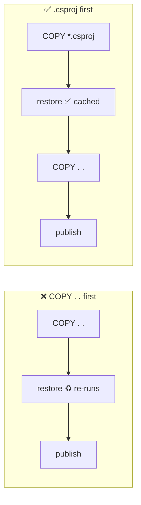

# Layers & Build Cache

> Each filesystem instruction = one layer. If its inputs didn't change, Docker reuses it from cache.

## Problem
Editing one `.cs` line re-runs `dotnet restore` on every build → slow builds.



## Example
```dockerfile
# Stable: changes only when a package is added
COPY HelloApi.csproj .
RUN dotnet restore

# Volatile: changes on every commit
COPY . .
RUN dotnet publish -c Release --no-restore -o /app
```

## See the Layers — `docker history hello-dotnet:good`
```
SIZE     CREATED BY
143kB    COPY --chown=1654:1654 /app .       ← your app: the only layer that changes per deploy
27.4MB   COPY /dotnet /usr/share/dotnet      ← ASP.NET Core
82.8MB   COPY /dotnet /usr/share/dotnet      ← .NET runtime
3.06MB   RUN apk add … (icu, ssl, …)
9.08MB   ADD alpine-minirootfs-3.24.2 …      ← Alpine base
```
→ A deploy pushes/pulls **143 kB**, not 123 MB: the server already has the rest.

## Cache Rules
| Instruction | Cache invalidated when |
|---|---|
| `RUN` | Command text changes (not what it downloads) |
| `COPY` / `ADD` | Content of copied files changes |
| Any | A layer **above** it was invalidated |

## Numbers — measured, Docker Desktop, 4 CPUs
| Change | `Dockerfile.naive` (`COPY . .` first) | `Dockerfile` (`.csproj` first) |
|---|---|---|
| Edit `Program.cs`, 0 packages | 7.6 s | 7.3 s |
| Edit `Program.cs`, 3 packages* | 107–137 s (restore every time) | 19–45 s (restore `CACHED`) |
| Edit `.csproj`, 3 packages* | ≈ same (always restores) | 29 s (cache mount: restore 10.7 s) |

\* Npgsql EF Core, Serilog.AspNetCore, Swashbuckle → the gain grows with package count.

## BuildKit Cache Mount
```dockerfile
# NuGet packages persist between builds but never enter the image
RUN --mount=type=cache,id=nuget,target=/root/.nuget/packages \
    dotnet restore
```

## Key Points
- Stable on top, volatile below
- One change invalidates everything below
- Cache mounts survive `.csproj` changes
- CI runners start empty → `cache-from: type=gha` ([26](../06-modern-tools/26-github-actions-ghcr.md))

## Pitfall
❌ `RUN apt-get update` and `RUN apt-get install` as two lines → ✅ One `RUN`; otherwise a cached, stale package index is reused

---
← [06 Dockerfile](06-dockerfile.md) · [Next → 08 Multi-stage Builds](08-multi-stage.md)
