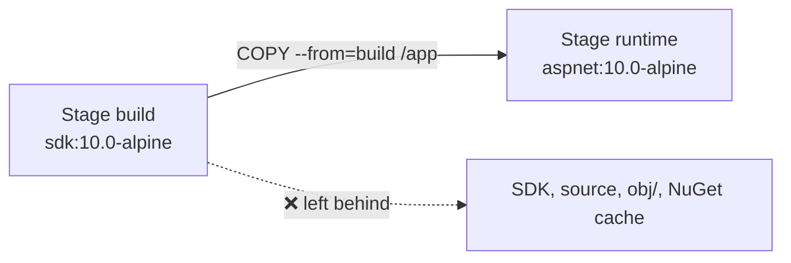

# Multi-stage Builds

> Build with the heavy SDK image, then copy **only** the published output into a small runtime image.

## Problem
Shipping the SDK to production = huge image, slow pulls, compilers available to attackers.



## Example — [examples/01-hello-dotnet/Dockerfile](../../examples/01-hello-dotnet/Dockerfile)
```dockerfile
# ---------- build ----------
FROM mcr.microsoft.com/dotnet/sdk:10.0-alpine AS build
WORKDIR /src
COPY HelloApi.csproj .
RUN dotnet restore
COPY . .
RUN dotnet publish -c Release --no-restore -o /app

# ---------- runtime ----------
FROM mcr.microsoft.com/dotnet/aspnet:10.0-alpine AS runtime
WORKDIR /app
COPY --from=build --chown=$APP_UID:$APP_UID /app .
USER $APP_UID
ENTRYPOINT ["dotnet", "HelloApi.dll"]
```

## Numbers — measured
| Dockerfile | Final base | Size (`docker ps -s` virtual) |
|---|---|---|
| `Dockerfile.naive` | `sdk:10.0` | 953 MB |
| `Dockerfile` | `aspnet:10.0-alpine` | 123 MB |

→ **7.7× smaller**, same app. (`docker image ls` shows 1.3 GB vs 177 MB: it also counts compressed layers.)

## Runtime Image Options (.NET 10) — measured
| Tag | Size | Shell | `wget` healthcheck | Use when |
|---|---|---|---|---|
| `aspnet:10.0` (Debian) | 244 MB | ✅ `bash` | ❌ not installed | Need Debian packages |
| `aspnet:10.0-alpine` | 122 MB | ✅ `sh` | ✅ BusyBox | Default choice here |
| `aspnet:10.0-noble-chiseled` | 125 MB | ❌ none | ❌ | Max security, health checked from outside |

Self-contained / Native AOT → `runtime-deps` base, even smaller (Phase 9).

## Useful Tricks
```bash
docker build --target build -t hello:build .   # stop at a stage (run tests there)
docker build --target runtime -t hello:good .  # default = last stage
```

## Key Points
- Name every stage `AS name`
- Final stage = what ships
- `USER $APP_UID` = built-in non-root (1654)

## Pitfall
❌ `FROM sdk` as final stage → ✅ `FROM aspnet` (or `runtime-deps` for self-contained)

---
← [07 Layers & Cache](07-layers-cache.md) · [Next → 09 .dockerignore](09-dockerignore.md)
