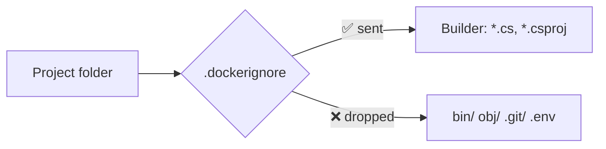

# .dockerignore

> Excludes files from the **build context** before they are sent to the builder.

## Problem
`COPY . .` also copies `bin/`, `obj/`, `.git/`, `.env` → bigger context, leaked secrets, and **broken builds**.



## Example — [examples/01-hello-dotnet/.dockerignore](../../examples/01-hello-dotnet/.dockerignore)
```gitignore
**/bin
**/obj
**/.vs
**/.vscode
**/*.user
.git
.env
Dockerfile*
README.md
```

## Numbers — measured on this example after a host `dotnet build`
| | Context sent | Build |
|---|---|---|
| With `.dockerignore` | 1.96 kB | ✅ |
| Without | 631 kB (322×) | ❌ **fails** |

```
error MSB4018: The "ResolvePackageAssets" task failed unexpectedly.
NuGet.Packaging.Core.PackagingException: Unable to find fallback package folder
'C:\Program Files (x86)\Microsoft Visual Studio\Shared\NuGetPackages'.
```
→ `COPY . .` overwrote the Linux `obj/project.assets.json` with the **Windows** one.

```bash
# Check your own context size
docker build --progress=plain . 2>&1 | grep "transferring context"
```

## Syntax — close to `.gitignore`, not identical
| Pattern | `.gitignore` | `.dockerignore` |
|---|---|---|
| `bin` | Any `bin/` at any depth | Only `./bin` at the root |
| `**/bin` | Any depth | Any depth ✅ |
| `!keep.txt` | Re-include | Re-include |

## Key Points
- Use `**/` for nested folders
- Lives at the build context root
- Always ignore `.env`, `.git`, `bin`, `obj`

## Pitfall
❌ Relying on `.gitignore` → ✅ Docker never reads `.gitignore`; only `.dockerignore`

---
← [08 Multi-stage Builds](08-multi-stage.md) · [Next → 10 Container Lifecycle](../03-containers/10-lifecycle.md)
