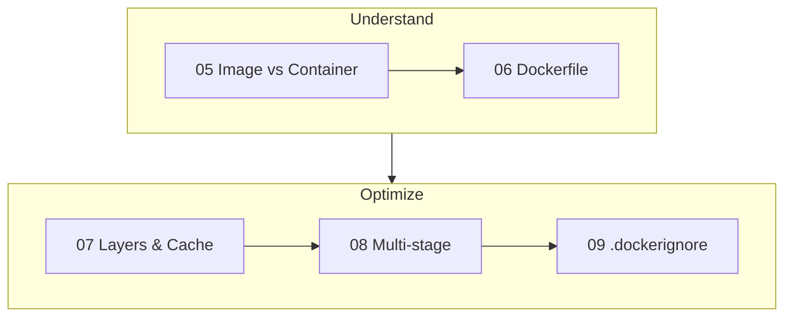

# Phase 2 — Images

> Build small, fast, cache-friendly images.

| # | Idea | One line | File |
|---|---|---|---|
| 05 | Image vs Container | Class vs object | [05](05-image-vs-container.md) |
| 06 | Dockerfile | The recipe, instruction by instruction | [06](06-dockerfile.md) |
| 07 | Layers & Cache | Stable first, changing last | [07](07-layers-cache.md) |
| 08 | Multi-stage | Build with SDK, ship runtime only | [08](08-multi-stage.md) |
| 09 | .dockerignore | Smaller context, no leaked secrets | [09](09-dockerignore.md) |

**Prerequisites:** [Phase 1 — Foundations](../01-foundations/README.md)
**Example:** [examples/01-hello-dotnet](../../examples/01-hello-dotnet)

---
← [Phase 1 — Foundations](../01-foundations/README.md) · [Next phase → 3 Containers](../03-containers/README.md)
