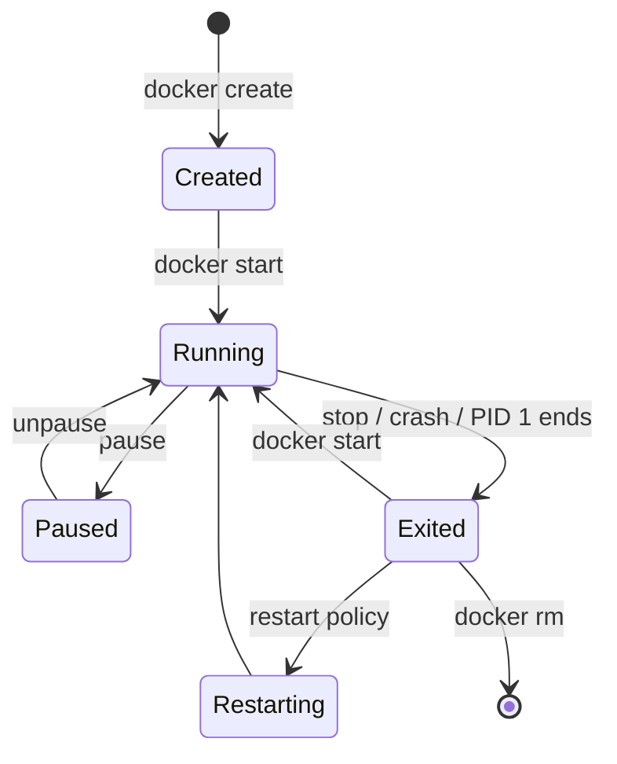

# Container Lifecycle

> A container lives as long as its PID 1 lives; its writable layer survives until `rm`.

## Problem
"My container disappeared" / "why `Exited (137)`?" / "why does `docker stop` take 10 s?"



## Example
```bash
docker run -d --name api -p 8080:8080 hello-dotnet:good   # create + start
docker ps                          # STATUS: Up 20 seconds (healthy)
docker stop api                    # SIGTERM → wait (-t seconds) → SIGKILL
docker ps -a                       # STATUS: Exited (0)  ← .NET shut down gracefully
docker start api                   # same container, same writable layer
docker rm -f api                   # gone (writable layer deleted)
```

## Shell Form vs Exec Form — measured `docker stop -t 10`
| ENTRYPOINT | PID 1 | Stop time | Exit |
|---|---|---|---|
| `["dotnet","HelloApi.dll"]` | `dotnet` | 1.1 s | 0 ✅ |
| `dotnet HelloApi.dll` on Debian | `/bin/sh` (ignores SIGTERM) | 10.8 s | 137 ❌ |
| `dotnet HelloApi.dll` on Alpine | `dotnet` (BusyBox `sh` execs it) | 1.0 s | 0 ⚠️ luck |

## Restart Policies
| `--restart` | Restarts on crash | After `docker stop` | After host reboot |
|---|---|---|---|
| `no` (default) | ❌ | ❌ | ❌ |
| `on-failure[:5]` | ✅ (exit ≠ 0) | ❌ | ✅ |
| `unless-stopped` | ✅ | ❌ | ✅ (unless stopped) |
| `always` | ✅ | ❌ | ✅ |

## Exit Codes
| Code | Meaning | Typical cause |
|---|---|---|
| 0 | Clean exit | App handled SIGTERM |
| 1 | App error | Unhandled startup exception |
| 137 | SIGKILL (128+9) | OOM kill / stop timeout |
| 139 | SIGSEGV (128+11) | Native crash |
| 143 | SIGTERM (128+15) | App didn't handle SIGTERM |

```bash
docker inspect api --format '{{.State.ExitCode}} OOM={{.State.OOMKilled}} restarts={{.RestartCount}}'
```

## Key Points
- `stop` = graceful, `kill` = immediate
- `--rm` auto-deletes on exit
- Prod: `--restart unless-stopped`

## Pitfall
❌ Long requests cut at shutdown → ✅ .NET waits up to 30 s (`ShutdownTimeout`); give Docker ≥ that: `docker stop -t 30` / Compose `stop_grace_period: 30s`

---
← [Phase 2](../02-images/README.md) · [Next → 11 Commands](11-commands.md)
