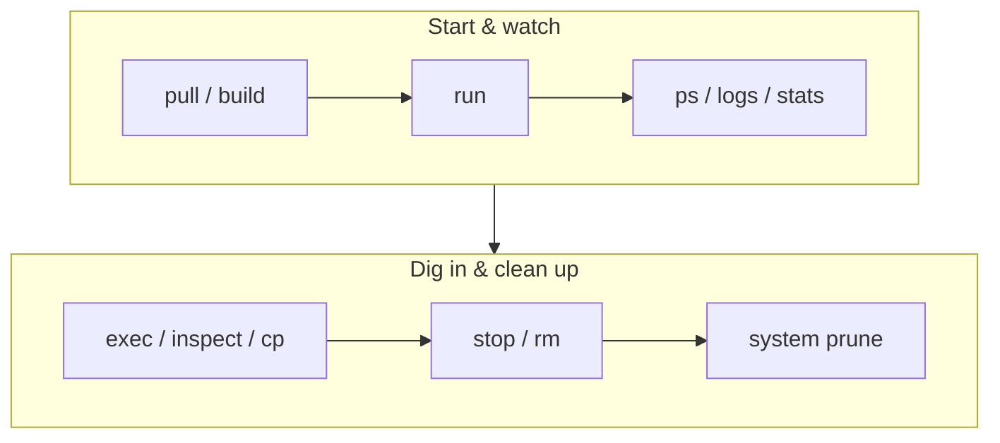

# Essential Commands

> ~20 commands cover 95% of daily Docker work.

## Problem
`docker --help` lists 60+ commands; you need the few that matter.



## Cheatsheet
| Task | Command |
|---|---|
| Run in background | `docker run -d --name api -p 8080:8080 img` |
| Run once, auto-delete | `docker run --rm -it alpine sh` |
| List running / all | `docker ps` / `docker ps -a` |
| Logs: follow / last 10 min | `docker logs -f --tail 100 api` / `--since 10m` |
| Shell inside | `docker exec -it api sh` |
| One field from JSON | `docker inspect api -f '{{.State.Status}}'` |
| Processes / ports | `docker top api` / `docker port api` |
| Live CPU/RAM | `docker stats` |
| Copy file in/out | `docker cp api:/app/HelloApi.dll .` |
| Restart / stop / remove | `docker restart api` / `stop` / `rm` |
| Images / layers | `docker image ls` / `docker history img` |
| Disk usage / clean | `docker system df` / `docker system prune` |

## Old vs New Syntax (both work)
| Short | Explicit |
|---|---|
| `docker ps` | `docker container ls` |
| `docker images` | `docker image ls` |
| `docker rmi img` | `docker image rm img` |

## Debug Session
```bash
docker ps -a --filter name=api                   # state + exit code
docker logs --tail 50 api                        # last error
docker exec api wget -qO- localhost:8080/health  # probe from inside
docker inspect api -f '{{json .State.Health}}'   # healthcheck history
```

## Which Shell? — measured
| Image | `bash` | `sh` |
|---|---|---|
| `aspnet:10.0` (Ubuntu 24.04) | ✅ | ✅ |
| `aspnet:10.0-alpine` (this repo) | ❌ `executable file not found` | ✅ |
| `aspnet:10.0-noble-chiseled` | ❌ | ❌ |

```bash
# No shell at all? Attach a toolbox container to the same PID + network namespaces
docker run --rm -it --pid=container:api --network=container:api nicolaka/netshoot
```

## Key Points
- `logs` before anything else
- `exec` only on running containers
- `sh` works where `bash` doesn't

## Pitfall
❌ `docker exec -it api bash` on Alpine → ✅ `docker exec -it api sh`

❌ `docker system prune -a --volumes` on prod → ✅ Plain `prune`; `--volumes` deletes unused **data**

---
← [10 Container Lifecycle](10-lifecycle.md) · [Next → 12 Environment Variables & Ports](12-env-ports.md)
