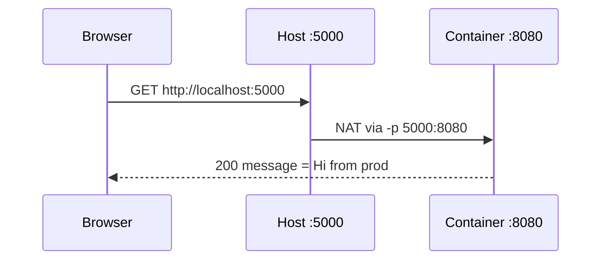

# Environment Variables & Ports

> `-e` configures the app without rebuilding; `-p` opens a host port to the container.

## Problem
Same image must run in dev and prod with different settings, reachable from outside.



## Example — real output
```bash
docker run -d --name api -p 5000:8080 \
  -e Greeting="Hi from prod" \
  -e ASPNETCORE_ENVIRONMENT=Production \
  hello-dotnet:good
curl localhost:5000
# {"message":"Hi from prod","machine":"7aad08dba26a","environment":"Production"}
```

## .NET Config Mapping
| appsettings.json | Env var |
|---|---|
| `"Greeting"` | `Greeting` |
| `"Logging": {"LogLevel": {"Default"}}` | `Logging__LogLevel__Default` |
| `"ConnectionStrings": {"Default"}` | `ConnectionStrings__Default` |

## Who Wins? — later overrides earlier
| # | Source | Example |
|---|---|---|
| 1 | `appsettings.json` | `"Greeting": "json"` |
| 2 | `appsettings.Production.json` | per environment |
| 3 | Env var | `-e Greeting=fromEnv` |
| 4 | Command-line arg | `docker run img --Greeting=fromArgs` → **fromArgs** (measured) |

## Port Binding
| Flag | Reachable from |
|---|---|
| `-p 5000:8080` | Everyone (all interfaces) |
| `-p 127.0.0.1:5000:8080` | Host only |
| *(no `-p`)* | Containers on the same network only |

## Key Points
- `EXPOSE` = documentation, not publishing
- `__` = nested config key
- .NET 8+ listens on 8080
- `docker inspect` shows every env var

## Pitfall
❌ `Greeting="Hi"` in a `--env-file` → ✅ Quotes are kept: app received `"Hi"` **with** the quotes; write `Greeting=Hi`

❌ `-p 5432:5432` on a VPS with ufw → ✅ Docker bypasses ufw; bind `127.0.0.1:` or don't publish

❌ `-e DB_PASSWORD=…` → ✅ Visible in `docker inspect`; use secret files ([32](../07-dotnet-vps/32-compose-prod.md))

---
← [11 Essential Commands](11-commands.md) · [Next → 13 Resource Limits](13-limits.md)
