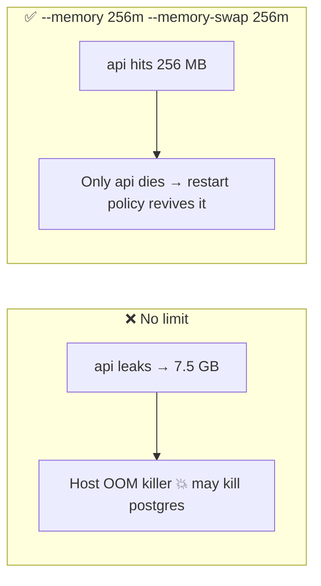

# Resource Limits

> Without limits, one leaking container can take all host RAM and kill everything else.

## Problem
Memory leak in one service → host OOM → the database gets killed too.



## Example
```bash
docker run -d --name api -p 8080:8080 \
  --memory 256m --memory-swap 256m --cpus 0.5 --pids-limit 200 \
  --restart unless-stopped \
  hello-dotnet:good

curl localhost:8080/limits                 # what .NET sees inside the cgroup
curl -X POST localhost:8080/allocate/100   # simulate a leak (see example README)
docker stats --no-stream api
```

## .NET Sees the Limits — measured (host: 4 CPUs / 7.7 GiB)
| Run flags | `gcHeapLimitMB` | `cpus` | `docker stats` |
|---|---|---|---|
| none | 7882 | 4 | 20 MiB / 7.698 GiB |
| `--memory 256m --cpus 0.5` | 192 (= 75% of 256) | 1 | 19 MiB / 256 MiB |

## What Happens at the Limit — measured
| Leak type (`/allocate`) | Result | Container | `/health` |
|---|---|---|---|
| Managed (`new byte[]`) at ~180 MB | `OutOfMemoryException` → HTTP 500 | Still running | ✅ Healthy 😱 |
| Native (`AllocHGlobal`) at ~256 MB | Kernel OOM kill | Exit 137, `OOMKilled=true` | ❌ |
| Native + `--restart unless-stopped` | Killed, then restarted | Running, `RestartCount=1` | ✅ |

→ A managed leak gives a **zombie**: up and "healthy", but returning 500s. Watch error rates, not just health.

## Flags
| Flag | Controls |
|---|---|
| `--memory 512m` | Hard RAM cap |
| `--memory-swap 512m` | RAM + swap total (= memory → no swap) |
| `--cpus 1.5` | CPU time quota |
| `--pids-limit 200` | Fork-bomb protection |

```yaml
# compose.yml equivalent
deploy:
  resources:
    limits: { memory: 512M, cpus: "1.0" }
```

## Key Points
- Always limit memory in prod
- Exit 137 + `OOMKilled=true` → raise limit or fix leak
- .NET GC caps heap at 75%

## Pitfall
❌ `--memory 256m` alone → ✅ Swap doubles it: a native leak reached 280 MB, still running; add `--memory-swap 256m`

❌ Limit = average usage → ✅ Limit ≈ peak × 1.5; watch `docker stats` first

---
← [12 ENV & Ports](12-env-ports.md) · Next phase → 04 Data & Network *(coming soon)*
