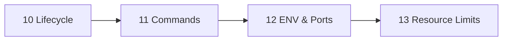

# Phase 3 — Containers

> Run, inspect, configure, and limit containers.

| # | Idea | One line | File |
|---|---|---|---|
| 10 | Lifecycle | States, exit codes, restart policies | [10](10-lifecycle.md) |
| 11 | Commands | Daily cheatsheet + which shell exists | [11](11-commands.md) |
| 12 | ENV & Ports | Configure and expose a container | [12](12-env-ports.md) |
| 13 | Resource Limits | Cap RAM/CPU; managed vs native OOM | [13](13-limits.md) |

**Prerequisites:** [Phase 2 — Images](../02-images/README.md)
**Example:** [examples/01-hello-dotnet](../../examples/01-hello-dotnet)

---
← [Phase 2](../02-images/README.md) · [Next phase → 04 Data & Network](../04-data-network/README.md)
