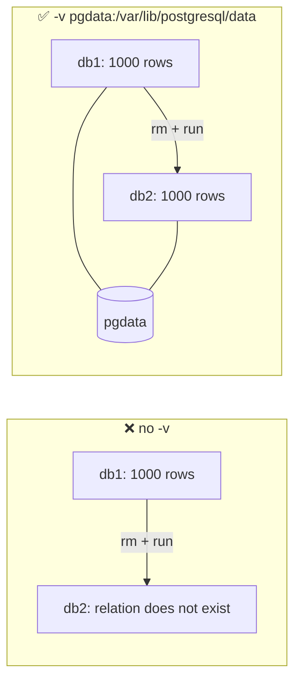

# Volumes

> A volume is storage managed by Docker that lives **outside** the container's writable layer.

## Problem
`docker rm` deletes the writable layer → a database without a volume loses everything.



## Example — measured
```bash
docker run -d --name db -e POSTGRES_PASSWORD=dev \
  -v pgdata:/var/lib/postgresql/data postgres:17-alpine
# insert 1000 rows → docker rm -f db → run again with the same -v
# SELECT count(*) FROM t → 1000 ✅   (without -v → ERROR: relation "t" does not exist)
docker volume ls
docker volume inspect pgdata -f '{{.Mountpoint}}'
```

## Mount Types
| Type | Syntax | Lives in | Use for |
|---|---|---|---|
| Named volume | `-v pgdata:/data` | Docker-managed | Databases, uploads |
| Anonymous volume | `VOLUME` in image, no `-v` | Docker, random name | ⚠️ Accidental |
| Bind mount | `-v ./src:/src` | Your host folder | Dev source, config ([15](15-bind-mounts.md)) |
| tmpfs | `--tmpfs /tmp` | RAM only | Scratch, secrets at runtime |

## Backup — measured on 100k rows
| Method | Size | Consistent while running? |
|---|---|---|
| `pg_dump \| gzip` | 211 KB | ✅ |
| `tar` of the volume | 5.9 MB (28× bigger) | ❌ stop the DB first |

```bash
docker exec db pg_dump -U postgres postgres | gzip > db-$(date +%F).sql.gz
```

## Key Points
- Volume outlives the container
- `docker rm -v` / `down -v` delete volumes
- Dump databases, don't tar them
- Daily backups → [backup.sh](../../examples/02-dotnet-api/backup.sh)

## Pitfall
❌ `docker run postgres` without `-v` → ✅ Image declares `VOLUME` → 2 runs left **2 anonymous volumes, 80 MB** behind; always name it

❌ Non-root app writes to a new volume path → ✅ `Permission denied` (dir owned by root); in Dockerfile: `RUN mkdir -p /app/data && chown $APP_UID /app/data` → `WRITE_OK`

---
← [13 Resource Limits](../03-containers/13-limits.md) · [Next → 15 Bind Mounts](15-bind-mounts.md)
