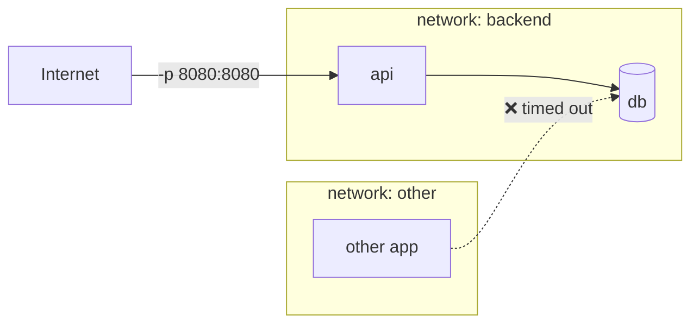

# Networking

> Each container gets its own network stack; Docker networks decide **who can reach whom**.

## Problem
API must reach Postgres, the internet must reach only the API, and the DB must stay private.



## Example — measured
```bash
docker network create backend
docker run -d --name db --network backend postgres:17-alpine …
docker run -d --name api --network backend -p 8080:8080 my-api

docker network ls
docker network inspect backend -f '{{(index .IPAM.Config 0).Subnet}}'   # 172.20.0.0/16
docker inspect api -f '{{range .NetworkSettings.Networks}}{{.IPAddress}}{{end}}'
```

## Drivers
| Driver | What | Use |
|---|---|---|
| `bridge` (default) | Private subnet `172.17.0.0/16`, NAT out | Legacy single containers |
| User-defined bridge | Same + **DNS by name** | ✅ Default choice |
| `host` | Shares host stack, no isolation | Linux perf edge cases |
| `none` | Only `lo` (measured: `127.0.0.1`, `::1`) | Batch jobs, max isolation |
| `overlay` | Spans many hosts | Swarm ([33](../07-deployment/33-scaling-path.md)) |

## Isolation — measured
| From | To `api` on `backend` | Result |
|---|---|---|
| Same network, by name | `wget http://api:8080` | ✅ 200 |
| Same network, by IP | `wget http://172.20.0.2:8080` | ✅ 200 |
| Other network, by IP | same | ❌ `download timed out` |
| Default bridge, by name | `wget http://api:8080` | ❌ `bad address` |

## Key Points
- Always create your own network
- Container ↔ container needs no `-p`
- `-p` only for traffic from outside
- One container can join many networks

## Pitfall
❌ `docker inspect -f '{{.NetworkSettings.IPAddress}}'` → ✅ Removed in Docker 29 (`map has no entry for key`); use `{{range .NetworkSettings.Networks}}{{.IPAddress}}{{end}}` — or better, use names ([17](17-dns.md))

---
← [15 Bind Mounts](15-bind-mounts.md) · [Next → 17 Container DNS](17-dns.md)
