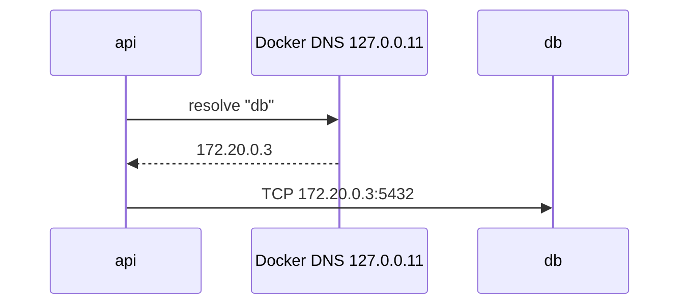

# Container DNS

> On a user-defined network, Docker runs a DNS server at `127.0.0.11` that resolves **container names and aliases**.

## Problem
Container IPs change on every restart; connection strings need stable names.



## Example
```bash
docker network create backend
docker run -d --name db --network backend -e POSTGRES_PASSWORD=dev postgres:17-alpine
docker run -d --name api --network backend \
  -e ConnectionStrings__Db="Host=db;Username=postgres;Password=dev" my-api
docker run --rm --network backend alpine cat /etc/resolv.conf   # nameserver 127.0.0.11
```

## Load Balancing With an Alias — measured
```bash
docker run -d --name api-a --network backend --network-alias api hello-dotnet:good
docker run -d --name api-b --network backend --network-alias api hello-dotnet:good
docker run --rm --network backend alpine nslookup api     # 172.20.0.3, 172.20.0.4
# 20 × wget http://api:8080 → api-a: 7, api-b: 13
```
→ Round-robin DNS, not a real load balancer: uneven, no health awareness.

## Who Is `localhost`?
| Inside a container, `localhost` = | |
|---|---|
| The container itself | ✅ (measured: `Connection refused` when nothing listens there) |
| The host machine | ❌ → use `host.docker.internal` (Desktop: resolves to `192.168.65.254`) |
| Another container | ❌ → use its name |

```bash
# Linux Engine: host.docker.internal must be added explicitly
docker run --add-host=host.docker.internal:host-gateway …
```

## Key Points
- Names work on user-defined networks only
- Default bridge: `bad address`
- Compose creates the network for you ([18](../05-compose/18-compose-basics.md))

## Pitfall
❌ `Host=localhost` in the connection string → ✅ `Host=db` (the service/container name)

---
← [16 Networking](16-networking.md) · [Next → 18 Compose Basics](../05-compose/18-compose-basics.md)
