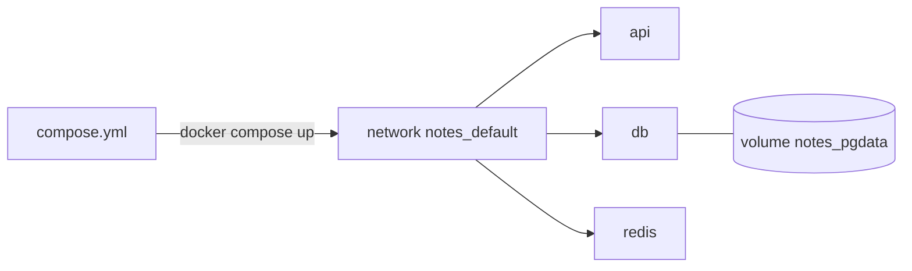

# Compose Basics

> `compose.yml` turns five long `docker run` commands into one versioned file and one command.

## Problem
API + DB + cache = 3 containers, 1 network, 2 volumes, 15 flags — typed by hand every time.



## Before → After
```bash
# ❌ by hand
docker network create notes
docker volume create pgdata
docker run -d --name db --network notes -v pgdata:/var/lib/postgresql/data -e POSTGRES_PASSWORD=dev postgres:17-alpine
docker run -d --name api --network notes -p 8080:8080 -e ConnectionStrings__Db="Host=db;…" my-api
```
```yaml
# ✅ compose.yml
services:
  api:
    build: .
    ports: ["8080:8080"]
    environment:
      ConnectionStrings__Db: Host=db;Database=notes;Username=notes;Password=dev
  db:
    image: postgres:17-alpine
    environment: { POSTGRES_PASSWORD: dev }
    volumes: ["pgdata:/var/lib/postgresql/data"]
volumes:
  pgdata:
```

## The 10 Commands
| Command | Does |
|---|---|
| `docker compose up -d --build` | Build + start everything |
| `docker compose up -d --wait` | …and block until all are healthy |
| `docker compose ps -a` | Status of every service |
| `docker compose logs -f api` | Follow one service |
| `docker compose exec db psql -U notes` | Shell/command in a running service |
| `docker compose run --rm migrator` | One-off container |
| `docker compose config` | Final merged YAML (validates too) |
| `docker compose down` | Stop + remove containers & network |
| `docker compose down -v` | …**and volumes** (data gone) |
| `docker compose ls` | All Compose projects on this host |

## Naming — automatic
| Thing | Name |
|---|---|
| Project | folder name, or `name:` in the file |
| Network | `notes_default` |
| Volume | `notes_pgdata` |
| Container | `notes-api-1` |
| DNS name | `api` (the service name, [17](../04-data-network/17-dns.md)) |

## Key Points
- One file = whole environment
- Service name = hostname
- `down` keeps volumes; `down -v` doesn't

## Pitfall
❌ `version: "3.8"` at the top → ✅ Obsolete; Compose v2 ignores it and warns — delete it

---
← [17 Container DNS](../04-data-network/17-dns.md) · [Next → 19 Anatomy of a Compose File](19-compose-anatomy.md)
