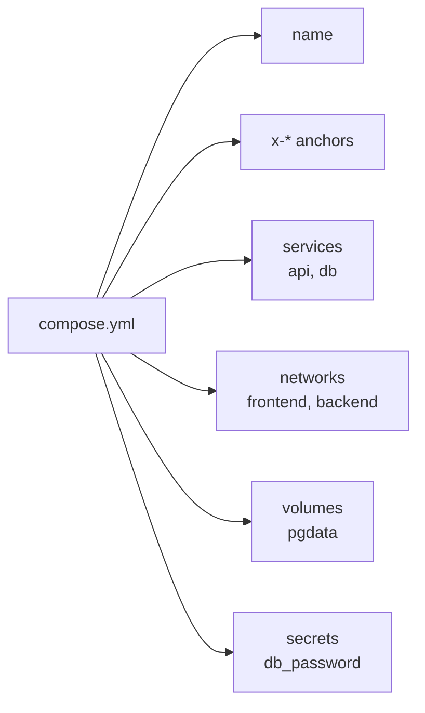

# Anatomy of a Compose File

> A Compose file has 5 top-level blocks; every service answers the same 8 questions — write them **in the same order** every time.

## Problem
Keys scattered randomly make a 200-line file impossible to review: "does the DB have a volume? a healthcheck? limits?"



## The 8 Questions Every Service Answers
| # | Question | Keys |
|---|---|---|
| 1 | **What** runs? | `image` / `build`, `command`, `entrypoint` |
| 2 | **Config**? | `environment`, `env_file`, `secrets`, `configs` |
| 3 | **Connect** how? | `ports`, `networks`, `expose` |
| 4 | **Store** where? | `volumes`, `tmpfs` |
| 5 | **Order & health**? | `depends_on`, `healthcheck` |
| 6 | **Lifecycle**? | `restart`, `stop_grace_period`, `init` |
| 7 | **Limits & logs**? | `deploy.resources`, `logging` |
| 8 | **Security**? | `user`, `read_only`, `cap_drop`, `security_opt` |

## Skeleton — validated with `docker compose config`
```yaml
name: notes
x-logging: &logging
  driver: local
  options: { max-size: "10m", max-file: "3" }

services:
  api:
    image: ghcr.io/you/notes-api:${IMAGE_TAG:?set IMAGE_TAG}   # 1 what
    environment: { ConnectionStrings__Redis: "redis:6379" }     # 2 config
    secrets: [db_password]
    ports: ["8080:8080"]                                       # 3 connect
    networks: [frontend, backend]
    volumes: ["dpkeys:/app/keys"]                               # 4 store
    depends_on: { db: { condition: service_healthy } }          # 5 order
    healthcheck: { test: ["CMD", "wget", "-qO-", "http://localhost:8080/health"], interval: 10s }
    restart: unless-stopped                                     # 6 lifecycle
    stop_grace_period: 30s
    deploy: { resources: { limits: { memory: 512M, cpus: "1.0" } } }   # 7 limits
    logging: *logging
    read_only: true                                             # 8 security
    tmpfs: [/tmp]
    cap_drop: [ALL]
  db:
    image: postgres:17-alpine
    environment: { POSTGRES_PASSWORD_FILE: /run/secrets/db_password }
    secrets: [db_password]
    networks: [backend]
    volumes: ["pgdata:/var/lib/postgresql/data"]
    healthcheck: { test: ["CMD-SHELL", "pg_isready -U postgres"], interval: 2s }
networks:
  frontend:
  backend: { internal: true }         # no route to the internet
volumes: { pgdata: , dpkeys: }
secrets:
  db_password: { file: ./secrets/db_password.txt }
```

## Measured — `${VAR:?msg}`
```
$ docker compose config          # IMAGE_TAG not set
error while interpolating services.api.image: required variable IMAGE_TAG is missing a value: set IMAGE_TAG
```
→ Fails **before** anything starts, instead of pulling `notes-api:` (empty tag).

## Key Points
- Full before → after: [24](24-compose-refactor.md)
- Same key order in every service
- Top-level `volumes`/`networks`/`secrets` declare; services use
- `x-` blocks + `&anchor` / `*alias` remove repetition

## Pitfall
❌ `version: "3.8"` on line 1 → ✅ Obsolete in Compose v2+; it's ignored with a warning — start with `name:` instead

---
← [18 Compose Basics](18-compose-basics.md) · [Next → 20 Multi-service App](20-multi-service-app.md)
