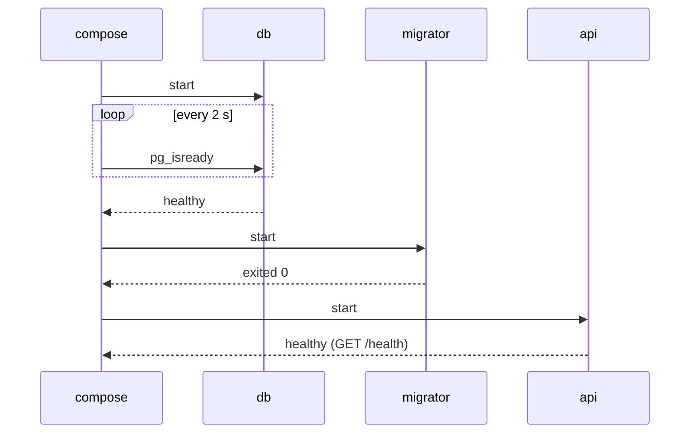

# Healthchecks & depends_on

> "Container started" ≠ "service ready". Healthchecks define ready; `depends_on` waits for it.

## Problem
Postgres takes seconds to accept connections; anything connecting earlier crashes.



## Measured — migrator started too early
```bash
docker compose up -d db && docker compose run --rm --no-deps migrator
# Npgsql.NpgsqlException: Failed to connect to 172.20.0.2:5432     ❌
docker compose up -d --wait        # with the conditions below → all healthy ✅
```

## Example — [compose.yml](../../examples/02-dotnet-api/compose.yml)
```yaml
services:
  api:
    depends_on:
      db:       { condition: service_healthy }
      redis:    { condition: service_healthy }
      migrator: { condition: service_completed_successfully }
  db:
    healthcheck:
      test: ["CMD-SHELL", "pg_isready -U notes -d notes"]
      interval: 2s
      retries: 30
```

## Conditions
| `condition` | Waits until |
|---|---|
| `service_started` (short form default) | Container process started — **not** ready |
| `service_healthy` | Healthcheck passes |
| `service_completed_successfully` | Container exited with 0 (jobs) |

## Healthcheck Fields
| Field | Meaning | Example |
|---|---|---|
| `test` | Command; exit 0 = healthy | `pg_isready`, `redis-cli ping`, `wget …/health` |
| `interval` | Time between checks | `10s` |
| `timeout` | Max time per check | `3s` |
| `retries` | Failures before `unhealthy` | `3` |
| `start_period` | Grace time at boot | `10s` |

## Key Points
- `depends_on: [db]` waits for nothing useful
- Every service needs a real healthcheck
- `up --wait` for scripts and CI

## Pitfall
❌ Healthcheck with `curl` in `aspnet:10.0` → ✅ Not installed ([08](../02-images/08-multi-stage.md)); use Alpine's `wget` or check from outside

---
← [19 Multi-service App](19-multi-service-app.md) · [Next phase → 06 Production Basics](../06-production-basics/README.md)
