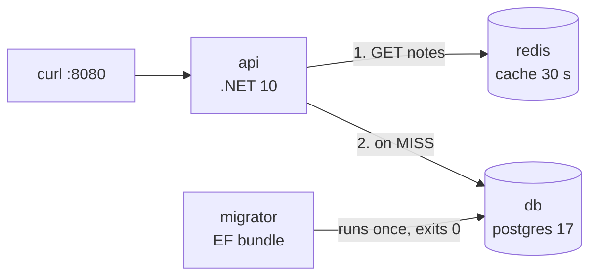

# Multi-service App

> A real .NET API with Postgres, Redis and a migration job — started with `docker compose up`.

## Problem
Real apps need a database, a cache and schema migrations — in the right order, on every machine.



## Example — [examples/02-dotnet-api](../../examples/02-dotnet-api)
```bash
cd examples/02-dotnet-api
docker compose up -d --build --wait
curl -X POST localhost:8080/notes -H 'Content-Type: application/json' -d '{"text":"Learn compose"}'
curl -i localhost:8080/notes        # X-Cache: MISS → then HIT
docker compose ps -a
# api       Up 16 seconds (healthy)
# db        Up 47 seconds (healthy)
# migrator  Exited (0) 17 seconds ago     ← ran migrations, done
# redis     Up 48 seconds (healthy)
```

## Numbers — measured
| Request | Latency |
|---|---|
| First `GET /notes` (cold EF + MISS) | 1.61 s |
| Warm MISS (Postgres, 3–6 rows) | 35–92 ms |
| HIT (Redis) | 9–31 ms |

→ With 6 rows the DB is already fast; caching pays off with heavy queries, not tiny tables.

## Failure Behaviour — measured
| Action | Result |
|---|---|
| `docker compose stop redis` | `/health` → **503 Unhealthy** |
| `docker compose down` → `up` | 3 notes still there (volume `notes_pgdata`) |
| `docker compose down -v` → `up` | Empty DB, migrator recreates schema |

## Services in This Stack
| Service | Image | Role |
|---|---|---|
| `api` | built `target: runtime` | HTTP, cache-aside |
| `migrator` | built `target: migrator` | `dotnet ef` bundle, exits |
| `db` | `postgres:17-alpine` | Data, named volume |
| `redis` | `redis:8-alpine` | Cache |

## Key Points
- One Dockerfile, two targets
- Migrations = separate one-shot job
- `/health` checks DB + Redis

## Pitfall
❌ `db.Database.Migrate()` in `Program.cs` → ✅ 2+ replicas race to migrate; run the migrator once before the app ([21](21-healthchecks-depends-on.md))

---
← [19 Anatomy of a Compose File](19-compose-anatomy.md) · [Next → 21 Healthchecks & depends_on](21-healthchecks-depends-on.md)
