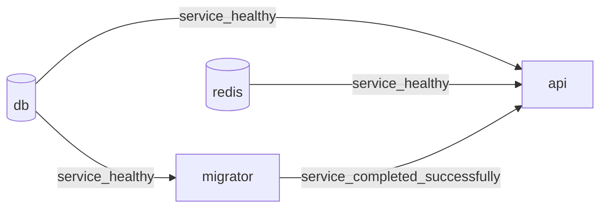
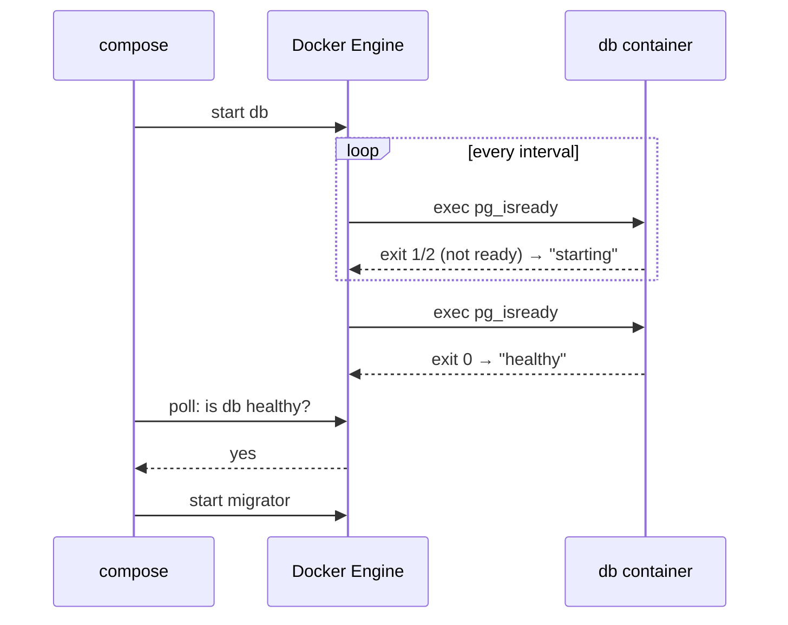
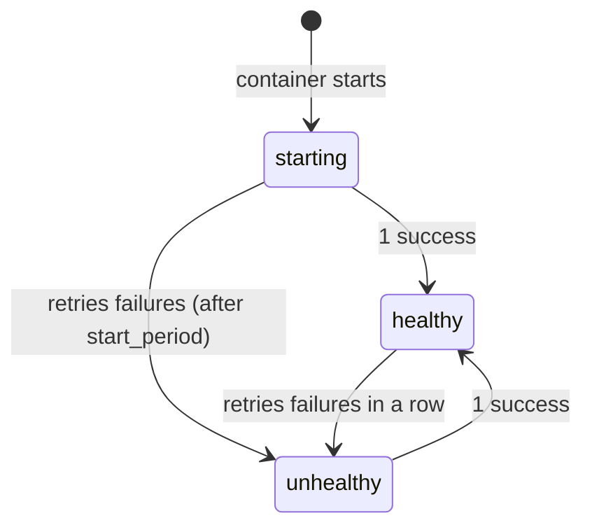

# Healthchecks & depends_on

> "Container started" ≠ "service ready". A healthcheck **defines** ready; `depends_on` **waits** for it.

## Problem
Postgres needs seconds after its container starts before it accepts connections. Anything that connects earlier fails.

## 1. Startup Order — the dependency graph

- `db` and `redis` have no dependencies → start **in parallel**
- `migrator` starts only when `db` is **healthy**
- `api` starts only when all three conditions are met

## 2. Who Runs the Check? — Docker Engine, not Compose

→ The check runs **inside** the container → the command (`pg_isready`, `wget`) must exist in that image.

## 3. Health States


## Measured — without the condition
```bash
docker compose up -d db && docker compose run --rm --no-deps migrator
# Npgsql.NpgsqlException: Failed to connect to 172.20.0.2:5432     ❌
docker compose up -d --wait        # with conditions → all healthy ✅
```

## Conditions
| `condition` | Waits until | Use for |
|---|---|---|
| `service_started` (short form `depends_on: [db]`) | Process started — **not** ready | Almost never |
| `service_healthy` | Healthcheck passes | Databases, caches, APIs |
| `service_completed_successfully` | Exited with 0 | Migrations, seed jobs |

Extra options: `restart: true` (restart me when the dependency restarts) · `required: false` (optional dependency).

## Key Points
- Engine runs checks; Compose waits
- Compose waits at **startup only**
- `up --wait` waits for the whole stack

## Pitfall
❌ `depends_on: [db]` "so db starts first" → ✅ It started first but wasn't ready → `Failed to connect`; use `condition: service_healthy`

➡️ Recipes for every common image + timing math: [22](22-healthcheck-recipes.md)

---
← [20 Multi-service App](20-multi-service-app.md) · [Next → 22 Healthcheck Recipes & Timing](22-healthcheck-recipes.md)
