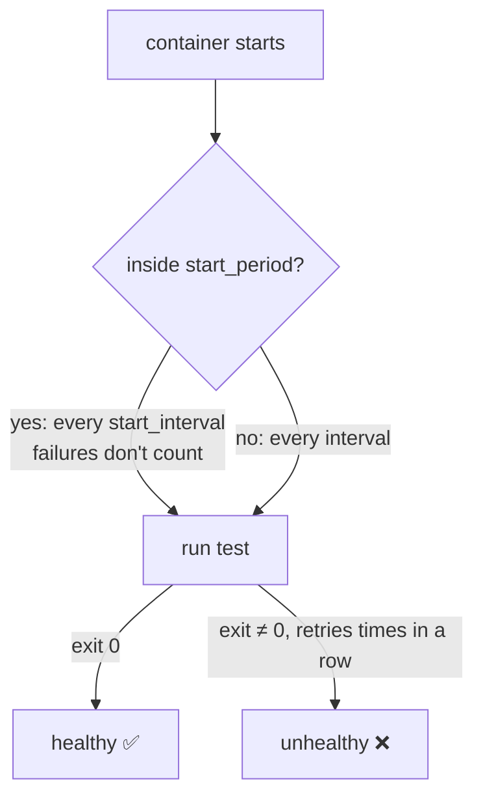

# Healthcheck Recipes & Timing

> Copy-paste checks for common images, plus the math behind "how long until healthy?".

## Problem
Defaults are slow (first check after 30 s), and the wrong syntax silently checks the wrong thing.



## Recipes
| Image | `test` |
|---|---|
| `postgres` | `["CMD-SHELL", "pg_isready -U $${POSTGRES_USER} -d $${POSTGRES_DB}"]` |
| `redis` | `["CMD", "redis-cli", "ping"]` |
| `mysql` | `["CMD", "mysqladmin", "ping", "-h", "localhost"]` |
| `mongo` | `["CMD", "mongosh", "--quiet", "--eval", "db.adminCommand('ping').ok"]` |
| `rabbitmq` | `["CMD", "rabbitmq-diagnostics", "-q", "ping"]` |
| `cassandra` | `["CMD-SHELL", "cqlsh -e 'describe keyspaces' > /dev/null"]` |
| .NET on `aspnet:*-alpine` | `["CMD", "wget", "-qO-", "http://localhost:8080/health"]` |
| .NET on `aspnet:10.0` (Ubuntu) | no `wget`/`curl` → install one, or check from outside |
| chiseled / distroless | no shell → check from outside (Caddy, Uptime Kuma) |

## `$` vs `$$` — measured with `docker compose config`
```yaml
test: ["CMD-SHELL", "pg_isready -U $POSTGRES_USER"]    # ❌
# WARN: The "POSTGRES_USER" variable is not set. Defaulting to a blank string.
# → runs: pg_isready -U                                   (wrong user)
test: ["CMD-SHELL", "pg_isready -U $$POSTGRES_USER"]   # ✅ container's own env var
```
`$` = your machine's env / `.env` at parse time · `$$` = literal `$`, expanded **inside** the container.

## `CMD` vs `CMD-SHELL`
| Form | Runs | Needs a shell | Use when |
|---|---|---|---|
| `["CMD", "redis-cli", "ping"]` | Directly | ❌ | Single command ✅ |
| `["CMD-SHELL", "a \|\| exit 1"]` | `/bin/sh -c` | ✅ | Pipes, `\|\|`, `$$VAR` |

## Timing Math
| Setting | Default | This repo (db) | This repo (api) |
|---|---|---|---|
| `interval` | 30 s | 2 s | 10 s |
| `timeout` | 30 s | 30 s | 3 s |
| `retries` | 3 | 30 | 3 |
| `start_period` | 0 s | 0 s | 10 s |

| Question | Formula | Defaults | db here |
|---|---|---|---|
| Earliest "healthy" | first check at `interval` | **30 s** even if ready at 2 s | 2 s |
| Give up (unhealthy) | ≈ `start_period` + `interval` × `retries` | 90 s | 60 s |

→ Add `start_period: 30s` + `start_interval: 1s`: frequent checks while booting, calm checks after.

## Key Points
- Always set `interval` below 30 s for dependencies
- The command must exist **in the image**
- `$$` for container variables

## Pitfall
❌ `curl -f http://localhost:8080/health` in an Alpine image → ✅ `curl` isn't there → check always fails → **unhealthy forever**; use BusyBox `wget -qO-`

---
← [21 Healthchecks & depends_on](21-healthchecks-depends-on.md) · [Next → 23 Compose Style Guide](23-compose-style-guide.md)
