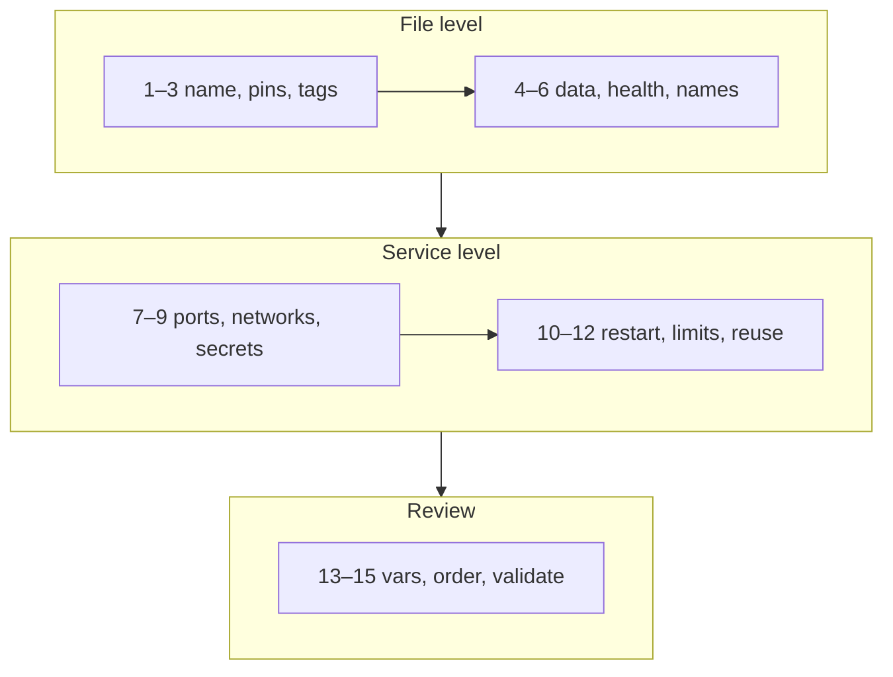

# Compose Style Guide — 15 Rules

> Rules that make a Compose file safe to run, easy to review, and ready for production. Each links to where it was measured.

## Problem
Compose accepts almost anything; a file that "works" can still lose data, leak secrets, or break deploys.

## The Rules
| # | ❌ Don't | ✅ Do | Why |
|---|---|---|---|
| 1 | `version: "3.8"` | `name: notes` | `version` is obsolete → warning ([19](19-compose-anatomy.md)) |
| 2 | `image: postgres` / `:latest` | `postgres:17-alpine` | Same version on every machine |
| 3 | `build:` in prod | `image: …:${IMAGE_TAG:?}` | Server never builds ([25](25-compose-dev-workflow.md)) |
| 4 | DB without volume | `pgdata:/var/lib/postgresql/data` | Data survives `rm` ([14](../04-data-network/14-volumes.md)) |
| 5 | `depends_on: [db]` | `condition: service_healthy` + healthcheck | Measured `Failed to connect` ([21](21-healthchecks-depends-on.md)) |
| 6 | `container_name: api` | Let Compose name it | Blocks `--scale`, clashes across projects ([35](../07-dotnet-vps/35-zero-downtime.md)) |
| 7 | `ports: ["5432:5432"]` | No ports on DB; dev: `127.0.0.1:5432:5432` | Docker bypasses ufw ([16](../04-data-network/16-networking.md)) |
| 8 | One flat network | `backend: { internal: true }` | DB has no internet route |
| 9 | `POSTGRES_PASSWORD: S3cret` | `secrets:` + `*_FILE` | Env visible in `inspect` ([32](../07-dotnet-vps/32-compose-prod.md)) |
| 10 | No `restart:` | `unless-stopped` (jobs: none) | Survives crashes/reboots ([10](../03-containers/10-lifecycle.md)) |
| 11 | No limits / log caps | `deploy.resources.limits` + `logging` | 44 MB logs, host OOM ([32](../07-dotnet-vps/32-compose-prod.md)) |
| 12 | Copy-paste per service | `x-logging: &logging` + `*logging` | One change, all services |
| 13 | `${TAG}` silently empty | `${TAG:?set TAG}` / `${PORT:-8080}` | Fail fast / sane default |
| 14 | Random key order | The 8-question order ([19](19-compose-anatomy.md)) | Reviewable diffs |
| 15 | "It ran on my laptop" | `docker compose config -q` in CI | Schema + interpolation errors caught |

## Variable Syntax Cheat Sheet
| Syntax | Unset → | Use for |
|---|---|---|
| `${VAR}` | empty + warning | ❌ avoid |
| `${VAR:-default}` | `default` | Optional settings |
| `${VAR:?message}` | **error, stops** | Required (tags, domains) |
| `$${VAR}` | literal `${VAR}` for the container | Healthchecks, commands ([22](22-healthcheck-recipes.md)) |

## Key Points
- Rules 4, 5, 9 prevent the worst incidents
- Anchors keep 5 services consistent
- Validate in CI, not in production

## Pitfall
❌ Fixing warnings by deleting the healthcheck → ✅ Fix the check; a service with no healthcheck can't be `service_healthy`, so its dependents never start

---
← [22 Healthcheck Recipes & Timing](22-healthcheck-recipes.md) · [Next → 24 Refactor: Before → After](24-compose-refactor.md)
