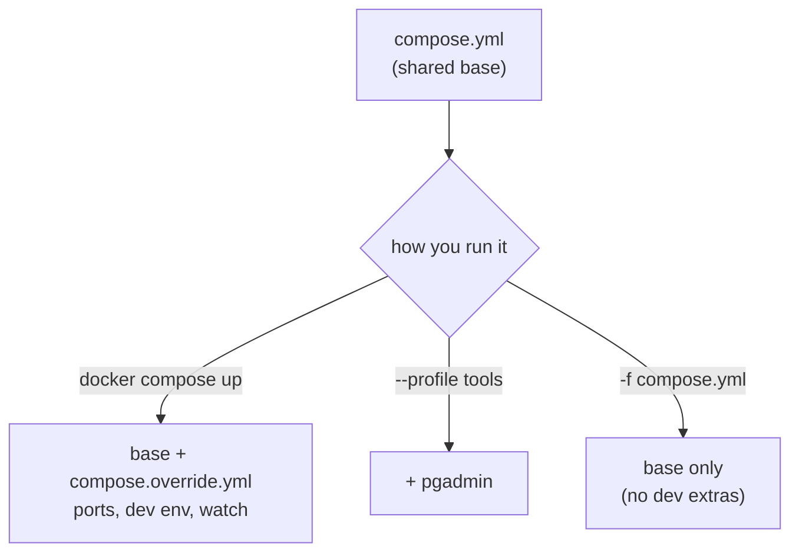

# Compose Dev Workflow

> One base file for every environment; dev extras live in an **override** file, optional tools behind **profiles**, and **watch** rebuilds on save.

## Problem
Dev needs open ports, debug tools, and fast feedback — prod needs none of them. Putting both in one file means shipping dev settings to prod.



## Example — `compose.override.yml` (auto-loaded)
```yaml
services:
  api:
    ports: ["8080:8080"]
    environment: { ASPNETCORE_ENVIRONMENT: Development }
    develop:
      watch:
        - action: rebuild                  # .cs changed → rebuild image + recreate
          path: ./src
          ignore: ["**/bin/", "**/obj/", "Api/appsettings.json"]
        - action: sync+restart             # config changed → copy + restart, no rebuild
          path: ./src/Api/appsettings.json
          target: /app/appsettings.json
  db:
    ports: ["127.0.0.1:5432:5432"]
  pgadmin:
    image: dpage/pgadmin4:latest
    profiles: [tools]                      # only with --profile tools
    ports: ["127.0.0.1:5050:80"]
```

## Measured — with `docker compose config`
| Command | Services | api published ports |
|---|---|---|
| `docker compose config` | `api`, `db` | `8080` (from override) |
| `docker compose --profile tools config` | `api`, `db`, `pgadmin` | `8080` |
| `docker compose -f compose.yml config` | `api`, `db` | **none** (override skipped) |

## Watch Actions
| Action | On change | Speed | Use for |
|---|---|---|---|
| `sync` | Copies file into container | Instant | Interpreted code, static files |
| `sync+restart` | Copy + restart container | Seconds | Config files |
| `rebuild` | Build image + recreate | Build time (19–45 s here) | Compiled .NET code |
```bash
docker compose up --watch        # or: docker compose watch
```

## Tools for Bigger Setups
| Tool | Example | Does |
|---|---|---|
| `include:` | `include: [../shared/monitoring.yml]` | Reuse another Compose file as-is |
| `--env-file` | `--env-file .env.staging` | Swap variable sets |
| `-f a -f b` | `-f compose.yml -f compose.prod.yml` | Explicit merge order (later wins) |

## Key Points
- Override = dev only, never deployed
- Profiles hide optional services
- `config` shows what will actually run

## Pitfall
❌ `docker compose up` on the server with an override file present → ✅ It's auto-loaded there too — dev ports get published in prod; in prod always use `-f compose.prod.yml`

---
← [24 Refactor: Before → After](24-compose-refactor.md) · [Next → 26 GHCR + GitHub Actions](../06-modern-tools/26-github-actions-ghcr.md)
