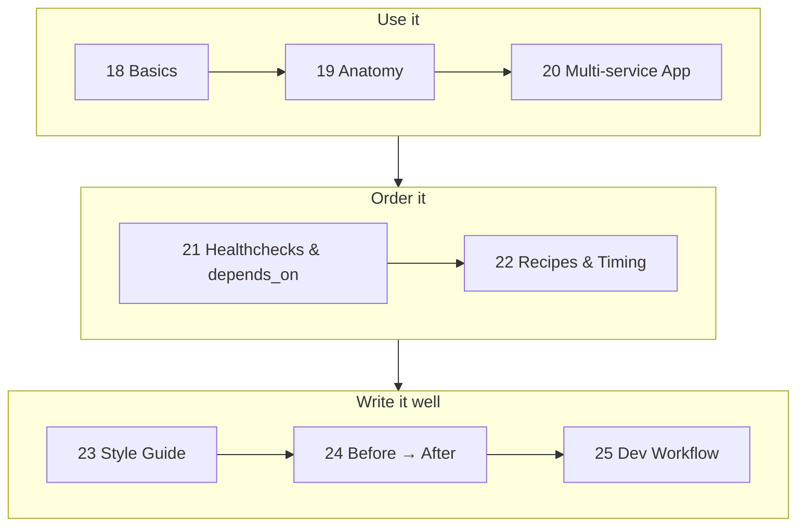

# Phase 5 — Compose

> Describe a multi-container app in one file, start it with one command — and learn to write that file **well**.

| # | Idea | One line | File |
|---|---|---|---|
| 18 | Compose Basics | `compose.yml` + the 10 commands | [18](18-compose-basics.md) |
| 19 | Anatomy | 5 top-level blocks, 8 questions per service | [19](19-compose-anatomy.md) |
| 20 | Multi-service App | API + Postgres + Redis + migrator | [20](20-multi-service-app.md) |
| 21 | Healthchecks & depends_on | Who checks, who waits, in what order | [21](21-healthchecks-depends-on.md) |
| 22 | Healthcheck Recipes | Copy-paste checks, `$` vs `$$`, timing math | [22](22-healthcheck-recipes.md) |
| 23 | Style Guide | 15 rules, each linked to evidence | [23](23-compose-style-guide.md) |
| 24 | Before → After | 15 lines, 10 problems, 10 fixes | [24](24-compose-refactor.md) |
| 25 | Dev Workflow | Override, profiles, `watch` | [25](25-compose-dev-workflow.md) |

**Prerequisites:** [Phase 4 — Data & Network](../04-data-network/README.md)
**Example:** [examples/02-dotnet-api](../../examples/02-dotnet-api)

---
← [Phase 4 — Data & Network](../04-data-network/README.md) · [Next phase → 6 Modern Tools](../06-modern-tools/README.md)
