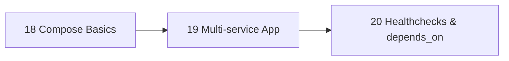

# Phase 5 — Compose

> Describe a multi-container app in one file; start it with one command.

| # | Idea | One line | File |
|---|---|---|---|
| 18 | Compose Basics | `compose.yml` + the 10 commands | [18](18-compose-basics.md) |
| 19 | Multi-service App | API + Postgres + Redis + migrator | [19](19-multi-service-app.md) |
| 20 | Healthchecks & depends_on | Start in the right order, measured | [20](20-healthchecks-depends-on.md) |

**Prerequisites:** [Phase 4 — Data & Network](../04-data-network/README.md)
**Example:** [examples/02-dotnet-api](../../examples/02-dotnet-api)

---
← [Phase 4](../04-data-network/README.md) · [Next phase → 06 Production Basics](../06-production-basics/README.md)
