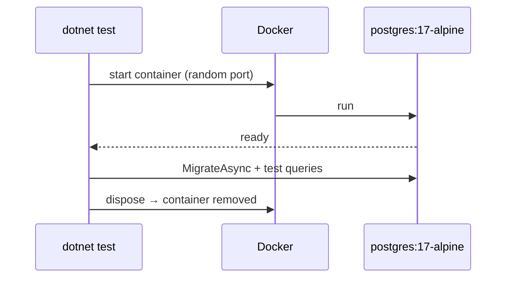

# Testcontainers

> Integration tests start **real** dependencies (Postgres, Redis…) in throwaway containers — no mocks, no shared test DB.

## Problem
Tests against mocks or in-memory providers miss real SQL, migrations, and constraint bugs; a shared test DB makes tests flaky.



## Example — [tests/Api.Tests](../../examples/02-dotnet-api/tests/Api.Tests/NotesDbTests.cs)
```csharp
public class NotesDbTests : IAsyncLifetime
{
    private readonly PostgreSqlContainer _postgres =
        new PostgreSqlBuilder("postgres:17-alpine").Build();

    public Task InitializeAsync() => _postgres.StartAsync();
    public Task DisposeAsync() => _postgres.DisposeAsync().AsTask();

    [Fact]
    public async Task Migrations_apply_and_notes_round_trip()
    {
        var opts = new DbContextOptionsBuilder<AppDb>().UseNpgsql(_postgres.GetConnectionString()).Options;
        await using var db = new AppDb(opts);
        await db.Database.MigrateAsync();           // same migrations the migrator runs
        …
    }
}
```

## Measured
```
cd examples/02-dotnet-api/tests/Api.Tests && dotnet test
Passed!  - Failed: 0, Passed: 1 — Duration: 57 s (first run, pulls images) / 40 s (warm)
```
Testcontainers.PostgreSql 4.15.0 · xunit 2.9.3 · on a loaded laptop.

## Mocks vs Testcontainers
| | In-memory / mocks | Testcontainers |
|---|---|---|
| Real SQL + migrations | ❌ | ✅ |
| Speed | ms | seconds |
| Needs Docker | ❌ | ✅ (CI runners have it) |

## Key Points
- One container per test class
- Same image tag as production
- Auto-cleaned (Ryuk sidecar)

## Pitfall
❌ EF Core versions drift between projects → ✅ Measured `CS1705` (10.0.12 vs 10.0.4); pin `Microsoft.EntityFrameworkCore` explicitly in the API

---
← [28 Trivy](28-trivy.md) · [Next → 30 VPS Setup](../07-dotnet-vps/30-vps-setup.md)
