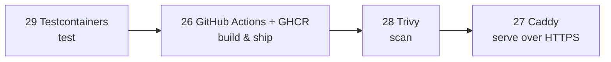

# Phase 6 — Modern Tools

> One tool per job — the strongest choice for a .NET API on a VPS. No comparisons to wade through.

| # | Job | Tool | Why this one | File |
|---|---|---|---|---|
| 26 | CI/CD + registry | GitHub Actions + GHCR | Free for private repos, `GITHUB_TOKEN` pushes images, build cache built in | [26](26-github-actions-ghcr.md) |
| 27 | Reverse proxy + HTTPS | Caddy | Auto HTTPS in 5 lines, no `docker.sock`, no certbot | [27](27-caddy.md) |
| 28 | Image scanning | Trivy | Free, one container, fails CI on CRITICAL (measured 41 → 0 CVEs) | [28](28-trivy.md) |
| 29 | Integration tests | Testcontainers | Real Postgres per test class, same image as prod | [29](29-testcontainers.md) |

**Used together in:** [examples/02-dotnet-api](../../examples/02-dotnet-api) → [Phase 7](../07-dotnet-vps/README.md)

---
← [Phase 5 — Compose](../05-compose/README.md) · [Next phase → 7 .NET API → VPS](../07-dotnet-vps/README.md)
