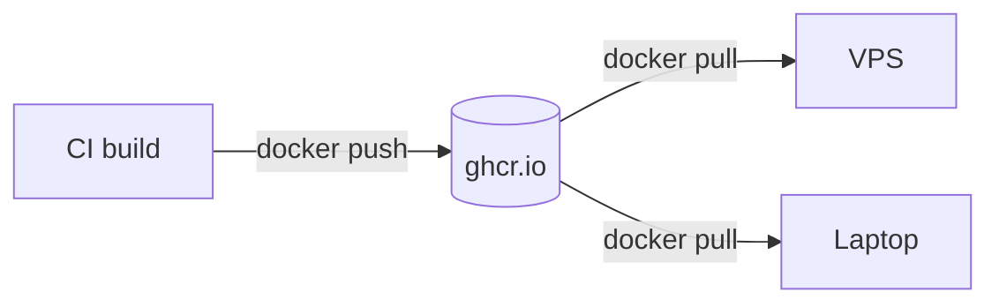

# Registry & Tags

> A registry stores images; a tag is a **movable** name, a digest is the **fixed** identity.

## Problem
The server must run exactly the image CI tested — not "whatever `latest` is today".



## Anatomy of an Image Reference
```
ghcr.io / you / notes-api : sha-3f2a1bc @sha256:f62a27…
└ registry └ owner └ repo      └ tag (movable) └ digest (immutable)
```

## Example
```bash
echo "$GH_TOKEN" | docker login ghcr.io -u <user> --password-stdin
docker tag notes-api:latest ghcr.io/<user>/notes-api:sha-3f2a1bc
docker push ghcr.io/<user>/notes-api:sha-3f2a1bc
docker pull mcr.microsoft.com/dotnet/aspnet@sha256:f62a272ac1b46e83f56b8ed0416572f31cd1128e2c4a5e63eb34d348e4a36095
```

## Tag Strategies
| Tag | Moves? | Rollback | Verdict |
|---|---|---|---|
| `latest` | Every push | ❌ Unknown what "previous" was | ❌ |
| `1.4.0` (semver) | Should not | ✅ | ✅ for releases |
| `sha-3f2a1bc` (git commit) | Never | ✅ exact code | ✅ for deploys |
| `@sha256:…` digest | Never | ✅ | ✅ base images |

## Registries
| Registry | Good for |
|---|---|
| GHCR (`ghcr.io`) | Code on GitHub; `GITHUB_TOKEN` in Actions |
| Docker Hub | Public images; anonymous pulls are rate-limited |
| ECR / ACR / Artifact Registry | Cloud (AWS / Azure / GCP) |
| Self-hosted `registry:2` | Air-gapped networks |

## One Tag, Many CPUs — measured
```
docker buildx imagetools inspect mcr.microsoft.com/dotnet/aspnet:10.0-alpine
  Platform: linux/amd64 · linux/arm64 · linux/arm/v7
```
→ Pulling picks the right one automatically ([34](../08-modern-tools/34-buildx.md)).

## Key Points
- Deploy by commit SHA
- Pin base images by digest
- Second push = changed layers only (143 kB, [07](../02-images/07-layers-cache.md))

## Pitfall
❌ `docker login` with your GitHub password → ✅ Personal access token (`read:packages` on servers, `write:packages` in CI)

---
← [Phase 5](../05-compose/README.md) · [Next → 22 Security](22-security.md)
