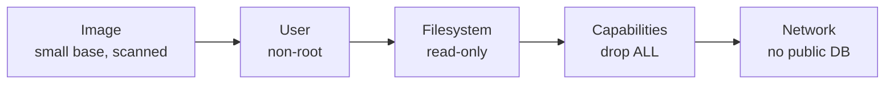

# Security

> Shrink what an attacker gets: fewer packages, no root, no capabilities, read-only filesystem, scanned image.

## Problem
A compromised app inherits everything the container has: root, a shell, compilers, write access, Linux capabilities.



## CVEs by Base Image — measured with Trivy, 2026-09-28
| Image | OS | LOW | MEDIUM | HIGH/CRIT | Total |
|---|---|---|---|---|---|
| `hello-dotnet:naive` (`sdk:10.0`) | Ubuntu 24.04 | 5 | 36 | 0 | **41** |
| `aspnet:10.0` | Ubuntu 24.04 | 5 | 9 | 0 | 14 |
| `aspnet:10.0-noble-chiseled` | Ubuntu (distroless) | 0 | 8 | 0 | 8 |
| `hello-dotnet:good` (`aspnet:10.0-alpine`) | Alpine 3.24 | 0 | 0 | 0 | **0** |
| `notes-api` (+ Npgsql, Redis) | Alpine 3.24 | 0 | 0 | 0 | **0** |

```bash
docker run --rm -v /var/run/docker.sock:/var/run/docker.sock aquasec/trivy image hello-dotnet:good
```

## Hardened Run — measured on `hello-dotnet:good`
```bash
docker run -d -p 8080:8080 \
  --read-only --tmpfs /tmp \
  --cap-drop ALL --security-opt no-new-privileges:true \
  hello-dotnet:good
curl localhost:8080/health                     # Healthy ✅
docker exec api touch /app/x                   # Read-only file system ✅
docker exec api grep CapEff /proc/1/status     # 0000000000000000 ✅ no capabilities
```
```yaml
# compose equivalent
read_only: true
tmpfs: [/tmp]
cap_drop: [ALL]
security_opt: ["no-new-privileges:true"]
```

## Who Is Running? — measured
| Image | `id -u` |
|---|---|
| `hello-dotnet:naive` | **0** (root) |
| `hello-dotnet:good` (`USER $APP_UID`) | 1654 |

## Key Points
- Fewer packages → fewer CVEs
- Non-root + read-only + no caps
- Scan in CI, fail on CRITICAL ([38](../08-modern-tools/38-image-scanning.md))
- Rebuild regularly: base images get patches

## Pitfall
❌ `-v /:/host` or `-v /etc:/etc` "just to read a config" → ✅ Root in the container read the host's `/etc/shadow` (measured); mount only the exact file, `:ro`

---
← [21 Registry & Tags](21-registry-tags.md) · [Next → 23 Debugging](23-debugging.md)
