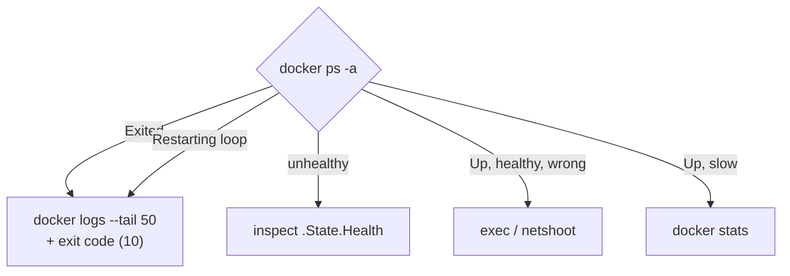

# Debugging

> Start from the symptom; each branch needs 1–2 commands.

## Problem
"It doesn't work" — crashed, unhealthy, unreachable, or slow? Each has a different first command.



## Toolkit
```bash
docker ps -a --filter name=api
docker logs --tail 50 --since 10m api
docker inspect api -f '{{.State.ExitCode}} OOM={{.State.OOMKilled}} restarts={{.RestartCount}}'
docker inspect api -f '{{json .State.Health}}'
docker exec -it api sh
docker stats --no-stream
docker events --filter container=api        # live: start, die, oom, health_status
```

## Real Errors — all reproduced in this repo
| Error | Cause | Fix | Doc |
|---|---|---|---|
| `port is already allocated` | Host port taken | Other host port / stop the other container | [12](../03-containers/12-env-ports.md) |
| `exec: "bash": executable file not found` | Alpine has only `sh` | `sh` | [11](../03-containers/11-commands.md) |
| `wget: bad address 'api'` | Default bridge / other network | User-defined network | [17](../04-data-network/17-dns.md) |
| `Connection refused` to `localhost` | `localhost` = the container | Service name | [17](../04-data-network/17-dns.md) |
| `Failed to connect to …:5432` | DB not ready yet | `service_healthy` | [20](../05-compose/20-healthchecks-depends-on.md) |
| `Permission denied` on a volume | Dir owned by root | `chown` in Dockerfile | [14](../04-data-network/14-volumes.md) |
| `The command could not be loaded` | Mount hid `/app` | Fix mount target | [15](../04-data-network/15-bind-mounts.md) |
| `Exited (137)`, `OOMKilled=true` | Memory limit | Raise limit / fix leak | [13](../03-containers/13-limits.md) |
| `exec format error` | amd64 vs arm64 image | `--platform` / multi-arch | [34](../08-modern-tools/34-buildx.md) |
| `MSB4018 … fallback package folder 'C:\…'` | Host `obj/` in context | `.dockerignore` | [09](../02-images/09-dockerignore.md) |

## No Shell in the Image?
```bash
docker run --rm -it --pid=container:api --network=container:api nicolaka/netshoot
# ps, curl, dig, tcpdump — inside api's namespaces
docker cp api:/app/appsettings.json .          # works without a shell
```

## Key Points
- `ps -a` → `logs` → `inspect`, in that order
- Exit code tells the story
- `docker events` shows what happened when

## Pitfall
❌ `docker restart api` until it works → ✅ Read `logs` + exit code first; restarts erase the evidence timeline

---
← [22 Security](22-security.md) · [Next → 24 Best Practices](24-best-practices.md)
