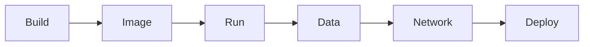

# Best Practices

> One page, grouped by stage — every rule links to where it was measured.

## Problem
40+ rules across 23 files; you need a single list to review a project against.

## Build
| ✅ Rule | Why (measured) | Doc |
|---|---|---|
| `.csproj` copied before source | Rebuild 107–137 s → 19–45 s | [07](../02-images/07-layers-cache.md) |
| `.dockerignore` with `**/bin`, `**/obj` | Without it the build fails | [09](../02-images/09-dockerignore.md) |
| BuildKit cache mounts for NuGet | Restore 10.7 s after `.csproj` change | [07](../02-images/07-layers-cache.md) |
| Comments only at line start | Mid-line `#` becomes an argument | [06](../02-images/06-dockerfile.md) |

## Image
| ✅ Rule | Why | Doc |
|---|---|---|
| Multi-stage, runtime base | 953 MB → 123 MB | [08](../02-images/08-multi-stage.md) |
| Pin base by tag or digest | Reproducible builds | [21](21-registry-tags.md) |
| `USER $APP_UID` | Naive image runs as uid 0 | [22](22-security.md) |
| Exec-form `ENTRYPOINT` | Stop 1.1 s / exit 0 vs 10.8 s / 137 | [10](../03-containers/10-lifecycle.md) |
| No secrets in `ARG`/`ENV` | `docker history` shows them | [26](../07-deployment/26-secrets.md) |

## Run
| ✅ Rule | Why | Doc |
|---|---|---|
| `--memory` + `--memory-swap` | Without swap cap: 280 MB under a 256 MB limit | [13](../03-containers/13-limits.md) |
| `restart: unless-stopped` | OOM-killed container came back | [13](../03-containers/13-limits.md) |
| Real healthcheck | Order startup; Caddy routes only to healthy | [20](../05-compose/20-healthchecks-depends-on.md) |
| `stop_grace_period: 30s` | .NET drains up to 30 s | [10](../03-containers/10-lifecycle.md) |

## Data
| ✅ Rule | Why | Doc |
|---|---|---|
| Named volume for every DB | No `-v` → data gone + 80 MB orphans | [14](../04-data-network/14-volumes.md) |
| `pg_dump`, off-site, tested restore | 211 KB vs 5.9 MB; restore 50/50 rows | [32](../07-deployment/32-backups.md) |

## Network
| ✅ Rule | Why | Doc |
|---|---|---|
| User-defined network, names not IPs | Default bridge: `bad address` | [17](../04-data-network/17-dns.md) |
| DB without `ports:` | Docker bypasses ufw | [16](../04-data-network/16-networking.md) |

## Deploy
| ✅ Rule | Why | Doc |
|---|---|---|
| Build in CI, tag = git SHA | Exact rollback | [46](../09-dotnet-vps/46-cicd.md) |
| Migrations as a one-shot job | Race: `Failed to connect` | [45](../09-dotnet-vps/45-ef-migrations.md) |
| Start-new-then-stop-old rollout | 17.4 s outage → 0 s | [29](../07-deployment/29-zero-downtime.md) |

## Key Points
- Review new projects against this page
- Inverse view: [25 anti-patterns](../10-anti-patterns/README.md)

## Pitfall
❌ Adopting every rule on day one → ✅ Start with the ones that lose data or break deploys: volumes, backups, SHA tags, non-root

---
← [23 Debugging](23-debugging.md) · [Next phase → 07 Deployment](../07-deployment/README.md)
