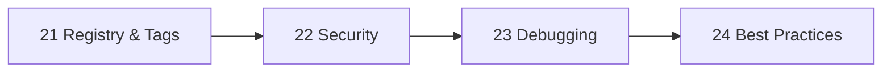

# Phase 6 — Production Basics

> Ship images safely: registries, security, debugging, and the rules that tie it together.

| # | Idea | One line | File |
|---|---|---|---|
| 21 | Registry & Tags | Push once, pull anywhere, tag by commit | [21](21-registry-tags.md) |
| 22 | Security | Non-root, read-only, no capabilities, scanned | [22](22-security.md) |
| 23 | Debugging | From symptom to cause in 5 commands | [23](23-debugging.md) |
| 24 | Best Practices | One-page checklist, linked | [24](24-best-practices.md) |

**Prerequisites:** [Phase 5 — Compose](../05-compose/README.md)

---
← [Phase 5](../05-compose/README.md) · [Next phase → 07 Deployment](../07-deployment/README.md)
