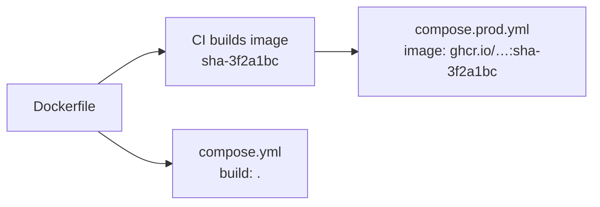

# Dev vs Prod Config

> Same images, different wiring: dev **builds** and exposes; prod **pulls** and locks down.

## Problem
One Compose file can't serve both: dev wants hot ports and plain passwords, prod wants neither.



## Example — [examples/02-dotnet-api](../../examples/02-dotnet-api)
```bash
docker compose up -d --build                       # dev: compose.yml
docker compose -f compose.prod.yml up -d           # prod: pulls, never builds
docker compose -f compose.prod.yml config          # see the final resolved file
```

## What Differs — from this repo's two files
| Concern | `compose.yml` (dev) | `compose.prod.yml` (prod) |
|---|---|---|
| Image | `build: { target: runtime }` | `image: ${REGISTRY}/notes-api:${IMAGE_TAG}` |
| DB port | `127.0.0.1:5432` for GUI tools | none |
| Password | Plain `dev` in the file | `secrets:` files ([26](26-secrets.md)) |
| Entry point | `:8080` direct | Caddy `:443` ([27](27-reverse-proxy.md)) |
| Restart | none | `unless-stopped` |
| Limits | none | `memory: 512M` |
| Logs | default | `local`, 10 MB × 3 ([30](30-logging.md)) |
| Migrator | runs on every `up` | `profiles: [tools]`, run explicitly |

## Alternative — Override Files
```bash
# compose.yml (shared) + compose.override.yml (dev, auto-loaded)
docker compose up
# compose.yml + compose.prod.yml (explicit)
docker compose -f compose.yml -f compose.prod.yml up -d
```
| Approach | Pro | Con |
|---|---|---|
| Two standalone files (this repo) | Each file readable alone | Some duplication |
| Base + overrides | No duplication | Must merge in your head → use `config` |

## Key Points
- Prod never runs `build:`
- `${VAR:?msg}` fails fast when unset
- `.env` feeds `${…}` interpolation

## Pitfall
❌ Forgetting `IMAGE_TAG` → ✅ `${IMAGE_TAG:?set IMAGE_TAG}` stops with an error instead of pulling `…:` (empty tag)

---
← [Phase 6](../06-production-basics/README.md) · [Next → 26 Secrets](26-secrets.md)
