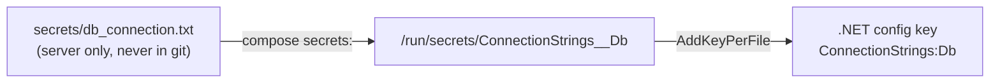

# Secrets

> Pass secrets as **files** mounted at `/run/secrets/`, not as env vars or build args.

## Problem
Env vars show up in `docker inspect`; build args show up in `docker history` — forever, in every copy of the image.



## Leaks — measured
```bash
docker build --build-arg NUGET_TOKEN=ghp_SuperSecret123 …
docker history img --no-trunc | grep -o 'NUGET_TOKEN=[^ ]*'
# NUGET_TOKEN=ghp_SuperSecret123          ❌ baked into the image metadata

docker inspect api -f '{{range .Config.Env}}{{println .}}{{end}}'
# Greeting=Hi from prod                   ❌ every -e value is readable
```

## Example — [compose.prod.yml](../../examples/02-dotnet-api/compose.prod.yml)
```yaml
services:
  api:
    secrets:
      - source: db_connection
        target: ConnectionStrings__Db        # file name = config key
  db:
    environment:
      POSTGRES_PASSWORD_FILE: /run/secrets/db_password   # official images support *_FILE
    secrets: [db_password]
secrets:
  db_connection: { file: ./secrets/db_connection.txt }
  db_password:   { file: ./secrets/db_password.txt }
```
```csharp
// Program.cs — each file in /run/secrets becomes a config key ("__" → ":")
builder.Configuration.AddKeyPerFile("/run/secrets", optional: true);
```
Result (measured): **0** env vars contain `password`; the app still connects.

## Where Secrets Go
| Secret needed at | Use |
|---|---|
| Runtime | Compose `secrets:` → `/run/secrets/*` |
| Build (private NuGet) | `RUN --mount=type=secret,id=nuget` |
| CI | GitHub Actions secrets |

## Key Points
- File secrets aren't in `inspect`
- `*_FILE` env vars in official images
- Rotate = replace file + recreate

## Pitfall
❌ `chmod 600` secret file owned by `deploy` → ✅ Compose bind-mounts it as-is; the api (UID 1654) can't read it → `chmod 444` or `chown 1654`

---
← [25 Dev vs Prod](25-dev-vs-prod.md) · [Next → 27 Reverse Proxy](27-reverse-proxy.md)
