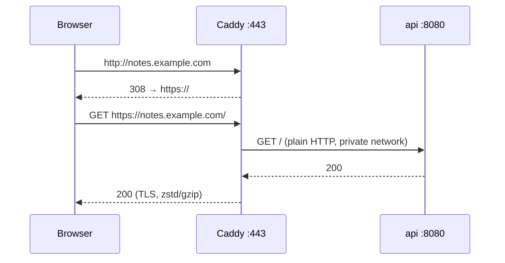

# Reverse Proxy + HTTPS

> One container owns ports 80/443, terminates TLS, and forwards to the app on the private network.

## Problem
The app shouldn't handle certificates, HTTP→HTTPS redirects, compression, or be exposed directly.



## Example — [Caddyfile](../../examples/02-dotnet-api/Caddyfile)
```
{$DOMAIN} {
	encode zstd gzip
	reverse_proxy api:8080 {
		health_uri /health
		health_interval 5s
	}
}
```
With `DOMAIN=notes.example.com` → Let's Encrypt certificate, auto-renewed. Nothing else to configure.

## Measured — local rehearsal (`DOMAIN=localhost`)
```bash
curl -sk https://localhost/        # {"service":"notes-api","version":"v1",…}
curl -s -o /dev/null -w '%{http_code} %{redirect_url}' http://localhost/
# 308 https://localhost/
```
→ `localhost` gets a certificate from Caddy's internal CA (hence `-k`).

## .NET Behind a Proxy
```yaml
environment:
  ASPNETCORE_FORWARDEDHEADERS_ENABLED: "true"   # trust X-Forwarded-Proto/For
```
| Without it | With it |
|---|---|
| `Request.Scheme` = `http` | `https` |
| `RemoteIpAddress` = Caddy's IP | Real client IP |
| Redirect URLs use `http://` | Correct |

## Caddy vs Alternatives
| | Caddy | Traefik | Nginx |
|---|---|---|---|
| Auto HTTPS | ✅ built-in | ✅ built-in | ❌ certbot |
| Config | Caddyfile | Container labels | nginx.conf |
| Detail | [36](../08-modern-tools/36-proxies.md) | [36](../08-modern-tools/36-proxies.md) | [36](../08-modern-tools/36-proxies.md) |

## Key Points
- Only the proxy publishes ports
- DNS A record must point first
- Persist `caddy_data` (certificates)

## Pitfall
❌ No volume for `/data` → ✅ Every restart requests new certificates → Let's Encrypt rate limits lock you out

---
← [26 Secrets](26-secrets.md) · [Next → 28 Restart & Health](28-restart-health.md)
