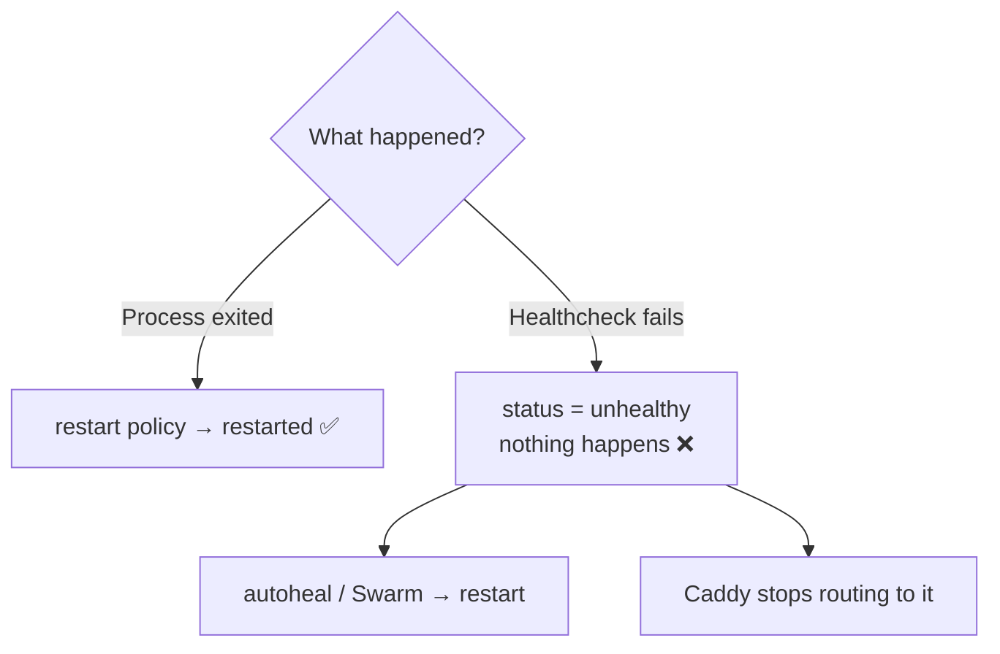

# Restart & Health

> Restart policies react to **crashes**; nothing in plain Docker reacts to **unhealthy**.

## Problem
A container can be up, "unhealthy", and serving errors for hours — and Docker will leave it alone.



## Measured
| Scenario | Result |
|---|---|
| Native leak → OOM kill, `--restart unless-stopped` | Restarted, `RestartCount=1` ✅ |
| `--health-cmd "exit 1"` + `--restart unless-stopped`, 12 s | `unhealthy`, `restarts=0` ❌ |
| Same + `willfarrell/autoheal` | Restarted every ~6 s ✅ |
| Managed leak (.NET) | Up **and healthy**, returning 500s ❌ ([13](../03-containers/13-limits.md)) |

## Example — autoheal
```yaml
services:
  autoheal:
    image: willfarrell/autoheal:latest
    restart: unless-stopped
    environment: { AUTOHEAL_CONTAINER_LABEL: autoheal }
    volumes: ["/var/run/docker.sock:/var/run/docker.sock"]
  api:
    labels: { autoheal: "true" }
```

## Restart Policy Cheat Sheet
| Policy | Use for |
|---|---|
| `unless-stopped` | Long-running services ✅ |
| `on-failure:5` | Jobs that may fail transiently |
| `no` | Migrator, one-off tasks |

## What a Good `/health` Checks
| Check | This repo |
|---|---|
| Process answers HTTP | ✅ |
| DB reachable | ✅ `CanConnectAsync` |
| Cache reachable | ✅ Redis `PING` → 503 when stopped |
| Error rate / memory | ❌ → monitoring ([31](31-monitoring.md)) |

## Key Points
- Crash → restart policy
- Unhealthy → autoheal, Swarm, or K8s
- Health ≠ "working" — watch error rates too

## Pitfall
❌ Mounting `docker.sock` into autoheal "because the README said so" → ✅ It's root on the host ([03](../01-foundations/03-architecture.md)); pin the image and accept the trade-off consciously

---
← [27 Reverse Proxy](27-reverse-proxy.md) · [Next → 29 Zero-downtime](29-zero-downtime.md)
