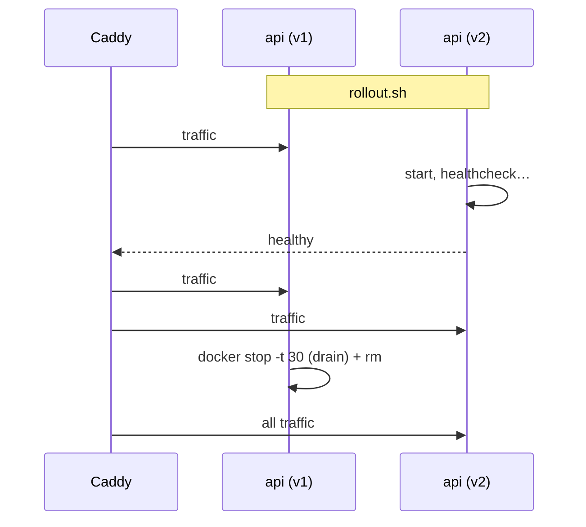

# Zero-downtime Deploy

> Start the new container **next to** the old one, wait until healthy, then remove the old one.

## Problem
`docker compose up -d` with a new tag stops the old container first → users get errors until the new one is ready.



## Measured — requests every 100 ms through Caddy during a deploy
| Method | Failed / total | Outage | Versions served |
|---|---|---|---|
| `docker compose up -d` (new tag) | 16 / 50 (502, 503) | **17.4 s** | v2 → gap → v1 |
| [`rollout.sh`](../../examples/02-dotnet-api/rollout.sh) | **0 / 67** | **0 s** | v1 → v1+v2 → v2 |
| [`rollback.sh`](../../examples/02-dotnet-api/rollback.sh) (same mechanism) | 0 / 61 | 0 s | v2 → v1 |

## Example — core of `rollout.sh`
```bash
OLD=$($C ps -q api)
$C up -d --no-deps --no-recreate --scale api=2 --wait api   # v1 + v2, both healthy
docker stop -t 30 $OLD && docker rm $OLD                      # drain + remove v1
$C up -d --no-deps --no-recreate --scale api=1 api
```
Reproduce: `./probe.sh &` then `SKIP_PULL=1 ./rollout.sh v2` in [examples/02-dotnet-api](../../examples/02-dotnet-api).

## Options
| Tool | How | Effort |
|---|---|---|
| `rollout.sh` (this repo) | Scale 2 → 1 | 10 lines |
| `docker rollout` plugin | Same idea, packaged | Install a plugin |
| Kamal | Proxy switches between containers | New tool ([37](../08-modern-tools/37-self-hosted-paas.md)) |
| Swarm `update_config: order: start-first` | Built-in | Swarm mode ([33](33-scaling-path.md)) |

## Requirements
- Healthcheck that means "ready"
- No `container_name:` (blocks scaling)
- No host `ports:` on the app (proxy only)
- Backward-compatible migrations ([45](../09-dotnet-vps/45-ef-migrations.md))

## Key Points
- Old serves until new is healthy
- `stop -t 30` lets requests finish
- Rollback = rollout of the previous tag

## Pitfall
❌ `container_name: api` → ✅ Two containers can't share a name; scaling to 2 fails — let Compose name them (`notes-api-2`, `-3`, …)

---
← [28 Restart & Health](28-restart-health.md) · [Next → 30 Logging](30-logging.md)
