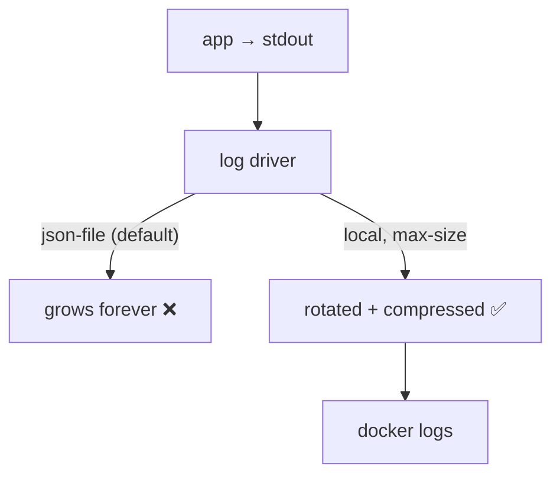

# Logging

> Docker captures stdout/stderr per container — by default **forever**, with no size limit.

## Problem
A chatty service fills the VPS disk; then Postgres can't write and everything stops.



## Measured — 400,000 log lines per container
| Driver / options | Disk used |
|---|---|
| `json-file` (default, no options) | **44 MB** — and growing |
| `json-file`, `max-size=1m, max-file=3` | 2.4 MB |
| `local`, `max-size=1m, max-file=3` | **480 KB** (compressed) |

## Example — per service ([compose.prod.yml](../../examples/02-dotnet-api/compose.prod.yml))
```yaml
x-logging: &logging
  driver: local
  options: { max-size: "10m", max-file: "3" }   # ≤ 30 MB per container
services:
  api:
    logging: *logging
```

## Example — host-wide default (`/etc/docker/daemon.json`)
```json
{ "log-driver": "local", "log-opts": { "max-size": "10m", "max-file": "3" } }
```
```bash
sudo systemctl restart docker     # applies to NEW containers only
```

## Structured Logs From .NET
```yaml
environment:
  Logging__Console__FormatterName: json    # one JSON object per line → easy to ship/query
```

## Reading Logs
```bash
docker compose -f compose.prod.yml logs -f --since 10m api
docker logs --tail 100 notes-api-2 2>&1 | grep -i exception
```

## Key Points
- Log to stdout, not files
- Always cap size
- Central logs (Loki, Seq) when > 1 server

## Pitfall
❌ Setting `daemon.json` and expecting old containers to change → ✅ Only new containers get it; recreate (`up -d --force-recreate`)

---
← [29 Zero-downtime](29-zero-downtime.md) · [Next → 31 Monitoring](31-monitoring.md)
