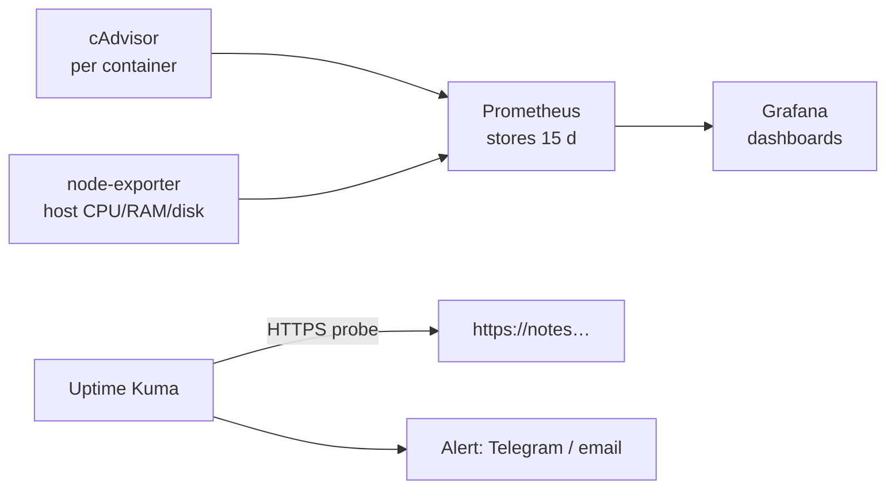

# Monitoring

> Metrics answer "what is slow / full / failing right now?" before users tell you.

## Problem
`docker stats` shows *now*; you need history, graphs, and alerts — for the host and every container.



## Example — [examples/03-monitoring](../../examples/03-monitoring)
```bash
cd examples/03-monitoring
docker compose up -d
ssh -L 3000:localhost:3000 deploy@your-vps     # UIs bind to 127.0.0.1 only
# Grafana → Dashboards → Import → ID 1860 (Node Exporter Full); search "cAdvisor" on grafana.com/dashboards
```
Validated: `docker compose config` ✅ · `promtool check config` ✅ (not run long-term on this laptop).

## What Each Piece Answers
| Tool | Question |
|---|---|
| node-exporter | Is the **disk** 90% full? RAM? load? |
| cAdvisor | Which **container** eats CPU/RAM? |
| Prometheus | Store metrics, evaluate alert rules |
| Grafana | Graphs over time |
| Uptime Kuma | Is the **public URL** up? Cert expiring? |

## First 5 Alerts
| Alert | Threshold |
|---|---|
| Disk usage | > 85% |
| Container restarted | `RestartCount` increased |
| Memory near limit | > 90% of `--memory` |
| URL down | 2 failed probes |
| TLS certificate | expires < 14 days |

## Resource Cost (typical)
| Stack | RAM |
|---|---|
| Uptime Kuma only | ~100 MB |
| Full stack (5 containers) | ~400–600 MB → size the VPS for it |

## Key Points
- Start with Uptime Kuma
- Add Prometheus stack at 2+ services
- Error rate catches the zombie ([13](../03-containers/13-limits.md))

## Pitfall
❌ `ports: ["3000:3000"]` for Grafana → ✅ Public admin UI with default `admin/admin`; bind to `127.0.0.1` and tunnel

---
← [30 Logging](30-logging.md) · [Next → 32 Backups](32-backups.md)
