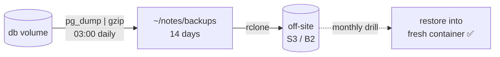

# Backups

> A backup exists only when it's **off the server** and a **restore has been tested**.

## Problem
Volume survives `docker rm` — but not a deleted VPS, a disk failure, or `down -v`.



## Example — [backup.sh](../../examples/02-dotnet-api/backup.sh)
```bash
docker compose -f compose.prod.yml exec -T db pg_dump -U notes notes | gzip > backups/notes-$(date +%F).sql.gz
find backups -name '*.sql.gz' -mtime +14 -delete
rclone copy backups remote:notes-backups
```
```cron
0 3 * * * /home/deploy/notes/backup.sh >> /home/deploy/notes/backup.log 2>&1
```

## Restore Drill — measured
```bash
docker run -d --name rtest -e POSTGRES_PASSWORD=x -e POSTGRES_USER=notes -e POSTGRES_DB=notes postgres:17-alpine
gunzip -c backups/notes-2026-09-28.sql.gz | docker exec -i rtest psql -q -U notes -d notes
docker exec rtest psql -U notes -d notes -tAc 'select count(*) from "Notes"'   # 50  (prod: 50) ✅
```
Restore time: **1.1 s** for 50 rows.

## Methods — measured on 100k rows ([14](../04-data-network/14-volumes.md))
| Method | Size | Safe while running | Restores to other Postgres versions |
|---|---|---|---|
| `pg_dump \| gzip` | 211 KB | ✅ | ✅ |
| `tar` of volume | 5.9 MB | ❌ stop DB | ❌ same major only |
| VPS snapshot | whole disk | ⚠️ crash-consistent | — |

## 3-2-1 Rule
| 3 copies | 2 media | 1 off-site |
|---|---|---|
| DB + local dump + remote | disk + object storage | different provider/region |

## Key Points
- Dump, compress, ship off-site
- Test restores on a schedule
- Also back up `.env` + `secrets/` (encrypted)

## Pitfall
❌ Backups only in `~/notes/backups` on the same VPS → ✅ Server lost = backups lost; `rclone` to another provider

---
← [31 Monitoring](31-monitoring.md) · [Next → 33 Scaling Path](33-scaling-path.md)
