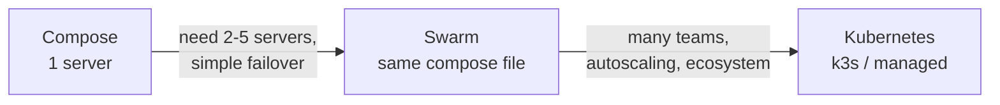

# Scaling Path — Compose → Swarm → Kubernetes

> Move up only when the current level hurts; each step adds real operational cost.

## Problem
"Should we use Kubernetes?" is usually asked years too early — or too late.



## Decision Table
| Signal | Compose | Swarm | Kubernetes |
|---|---|---|---|
| Servers | 1 | 2–10 | 3+ (often many) |
| Team | 1–5 devs | Small ops | Platform team |
| Zero-downtime | Script ([29](29-zero-downtime.md)) | Built-in | Built-in |
| Restart unhealthy | autoheal ([28](28-restart-health.md)) | Built-in | Built-in |
| Autoscaling | ❌ | ❌ | ✅ HPA |
| Learning curve | Hours | Days | Weeks–months |
| Typical cost | 1 VPS | 3 VPS | 3+ nodes (+ managed fee) |

## Example — the same file on Swarm
```bash
docker swarm init
docker stack deploy -c compose.prod.yml notes     # Swarm ignores depends_on conditions + profiles
```
```yaml
services:
  api:
    deploy:
      replicas: 2
      update_config: { order: start-first, failure_action: rollback }
```

## Example — Kubernetes equivalent (excerpt)
```yaml
apiVersion: apps/v1
kind: Deployment
metadata: { name: api }
spec:
  replicas: 2
  strategy: { rollingUpdate: { maxUnavailable: 0, maxSurge: 1 } }
  template:
    spec:
      containers:
        - name: api
          image: ghcr.io/you/notes-api:sha-3f2a1bc
          readinessProbe: { httpGet: { path: /health, port: 8080 } }
```

## Scale Vertically First (typical)
| VPS | Handles (simple .NET API + Postgres) |
|---|---|
| 2 vCPU / 4 GB | Thousands of requests/min |
| 8 vCPU / 32 GB | Most small–mid products |

## Key Points
- One bigger server beats three small ones early
- Swarm reuses your Compose knowledge
- k3s = Kubernetes on one 512 MB+ node

## Pitfall
❌ Kubernetes for one API and one DB → ✅ Compose + scripts; revisit when a real signal from the table appears

---
← [32 Backups](32-backups.md) · [Next phase → 08 Modern Tools](../08-modern-tools/README.md)
