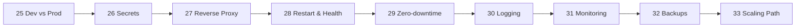

# Phase 7 — Deployment

> Everything between "it runs on my laptop" and "it runs reliably on a server".

| # | Idea | One line | File |
|---|---|---|---|
| 25 | Dev vs Prod | Two Compose files, different jobs | [25](25-dev-vs-prod.md) |
| 26 | Secrets | Files in `/run/secrets`, not env vars | [26](26-secrets.md) |
| 27 | Reverse Proxy + HTTPS | Caddy: TLS + redirect in 5 lines | [27](27-reverse-proxy.md) |
| 28 | Restart & Health | Docker won't restart "unhealthy" | [28](28-restart-health.md) |
| 29 | Zero-downtime | 17.4 s outage → 0 s | [29](29-zero-downtime.md) |
| 30 | Logging | Rotate or fill the disk | [30](30-logging.md) |
| 31 | Monitoring | Prometheus + Grafana + cAdvisor | [31](31-monitoring.md) |
| 32 | Backups | `pg_dump`, off-site, tested restore | [32](32-backups.md) |
| 33 | Scaling Path | Compose → Swarm → Kubernetes | [33](33-scaling-path.md) |

**Example:** [examples/02-dotnet-api](../../examples/02-dotnet-api) · [examples/03-monitoring](../../examples/03-monitoring)

---
← [Phase 6](../06-production-basics/README.md) · [Next phase → 08 Modern Tools](../08-modern-tools/README.md)
