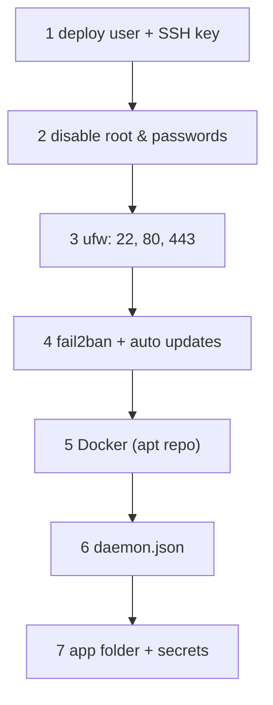

# VPS Setup

> One-time hardening of a fresh Ubuntu VPS before the first container runs.

## Problem
A fresh VPS has root SSH with a password and every port reachable — bots start guessing within minutes.



## Commands (as root, once)
```bash
adduser --disabled-password --gecos "" deploy
mkdir -p /home/deploy/.ssh && cp ~/.ssh/authorized_keys /home/deploy/.ssh/
chown -R deploy: /home/deploy/.ssh && chmod 700 /home/deploy/.ssh

sed -i 's/^#\?PasswordAuthentication.*/PasswordAuthentication no/; s/^#\?PermitRootLogin.*/PermitRootLogin no/' /etc/ssh/sshd_config
systemctl restart ssh

ufw allow OpenSSH && ufw allow 80/tcp && ufw allow 443/tcp && ufw allow 443/udp && ufw --force enable
apt-get install -y fail2ban unattended-upgrades

# Docker: official apt repo → see 04-install
usermod -aG docker deploy
```

## `/etc/docker/daemon.json`
```json
{
  "log-driver": "local",
  "log-opts": { "max-size": "10m", "max-file": "3" },
  "live-restore": true
}
```
| Key | Why |
|---|---|
| `log-driver: local` + limits | 44 MB → 480 KB per 400k lines (measured) |
| `live-restore` | Containers keep running while Docker itself upgrades/restarts |

## App Folder
```bash
sudo -iu deploy
mkdir -p ~/notes/secrets && cd ~/notes
# copy: compose.prod.yml Caddyfile *.sh .env (from .env.example) → then create secrets (see secrets/README.md)
chmod 600 .env
echo "$PAT" | docker login ghcr.io -u <user> --password-stdin
```

## Small VPS? Add Swap
```bash
fallocate -l 2G /swapfile && chmod 600 /swapfile && mkswap /swapfile && swapon /swapfile
echo '/swapfile none swap sw 0 0' >> /etc/fstab
```

## Key Points
- Keys only, no root login
- ufw for SSH/HTTP(S) only
- `deploy` in `docker` group = root-equivalent

## Pitfall
❌ `ufw deny 5432` and `ports: ["5432:5432"]` → ✅ Docker writes iptables rules **before** ufw → port is public anyway; don't publish DB ports ([16](../04-data-network/16-networking.md))

---
← [29 Testcontainers](../06-modern-tools/29-testcontainers.md) · [Next → 31 .NET Production Dockerfile](31-dotnet-dockerfile.md)
